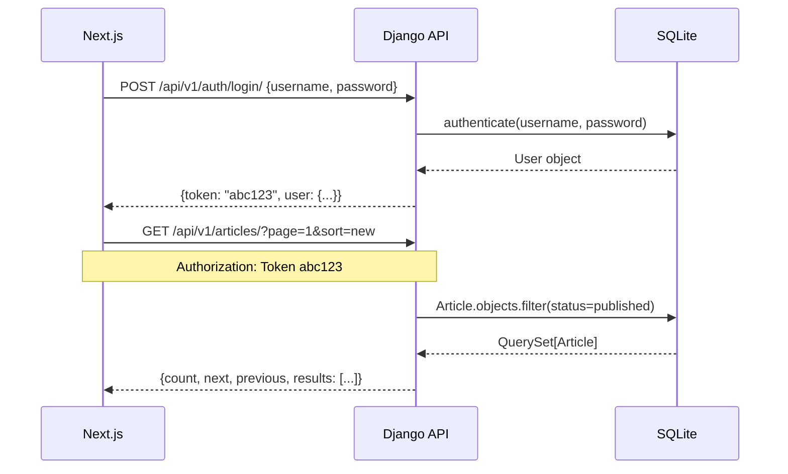
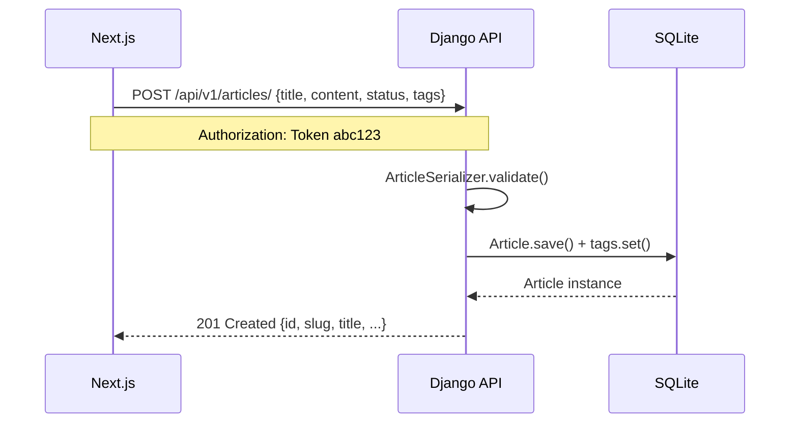

# Дизайн-документ: Django REST API

## Обзор

REST API на базе Django REST Framework (DRF) для блог-платформы, обеспечивающий взаимодействие между Django-бэкендом и Next.js-фронтендом. API предоставляет полный набор эндпоинтов для управления статьями, комментариями, голосованием, подписками, уведомлениями и профилями пользователей с поддержкой токен-аутентификации, CORS, пагинации, фильтрации и поиска.

Существующая MTV-архитектура (модели, views, urls в `blog/`) остаётся нетронутой — REST API добавляется параллельно в отдельном приложении `api/` с префиксом `/api/v1/`.

## Архитектура

```mermaid
graph TD
    FE[Next.js Frontend :3000]
    CORS[CORS Middleware]
    AUTH[TokenAuthentication / SessionAuthentication]
    ROUTER[DRF Router /api/v1/]
    
    FE -->|HTTP + Authorization: Token| CORS
    CORS --> AUTH
    AUTH --> ROUTER

    ROUTER --> AV[ArticleViewSet]
    ROUTER --> CV[CommentViewSet]
    ROUTER --> TV[TagViewSet]
    ROUTER --> PV[ProfileViewSet]
    ROUTER --> NV[NotificationViewSet]

    AV --> VOTE[POST /articles/{slug}/vote/]
    AV --> FEED[GET /articles/feed/]
    PV --> FOLLOW[POST /profiles/{username}/follow/]

    AUTH_EP[/api/v1/auth/]
    ROUTER --> AUTH_EP
    AUTH_EP --> LOGIN[POST /auth/login/]
    AUTH_EP --> LOGOUT[POST /auth/logout/]
    AUTH_EP --> REGISTER[POST /auth/register/]
    AUTH_EP --> ME[GET /auth/me/]

    AV --> DB[(SQLite)]
    CV --> DB
    PV --> DB
    NV --> DB
```

## Диаграммы последовательностей

### Аутентификация и получение статей



### Создание статьи



## Компоненты и интерфейсы

### Структура приложения `api/`

```
api/
├── __init__.py
├── apps.py
├── urls.py
├── serializers.py
├── views.py
├── permissions.py
└── filters.py
```

### Сериализаторы

```python
# Пользователь (вложенный, только чтение)
class UserSerializer(ModelSerializer):
    fields: [id, username]

# Профиль
class ProfileSerializer(ModelSerializer):
    user: UserSerializer  # read_only, nested
    followers_count: SerializerMethodField
    is_following: SerializerMethodField  # зависит от request.user
    fields: [user, avatar, bio, followers_count, is_following]

# Тег
class TagSerializer(ModelSerializer):
    fields: [id, name, slug]

# Статья (список)
class ArticleListSerializer(ModelSerializer):
    author: UserSerializer       # read_only
    tags: TagSerializer(many)    # read_only
    rating: SerializerMethodField
    fields: [id, slug, title, author, tags, status, views, rating, created_at]

# Статья (детальная)
class ArticleDetailSerializer(ArticleListSerializer):
    comments: CommentSerializer(many, read_only)
    fields: [...ArticleListSerializer, content, comments, updated_at]

# Статья (запись — создание/редактирование)
class ArticleWriteSerializer(ModelSerializer):
    tags: ListField(child=CharField())  # принимает список строк ["python", "django"]
    fields: [title, content, status, tags]

# Комментарий
class CommentSerializer(ModelSerializer):
    author: UserSerializer  # read_only
    fields: [id, author, content, created_at]

# Уведомление
class NotificationSerializer(ModelSerializer):
    actor: UserSerializer   # read_only
    article: ArticleListSerializer  # read_only
    fields: [id, actor, article, is_read, created_at]
```

### ViewSet'ы

```python
class ArticleViewSet(ModelViewSet):
    # list:    GET  /api/v1/articles/
    # create:  POST /api/v1/articles/
    # retrieve: GET /api/v1/articles/{slug}/
    # update:  PUT  /api/v1/articles/{slug}/
    # partial_update: PATCH /api/v1/articles/{slug}/
    # destroy: DELETE /api/v1/articles/{slug}/
    
    lookup_field = 'slug'
    permission_classes = [IsAuthenticatedOrReadOnly, IsAuthorOrReadOnly]
    filter_backends = [SearchFilter, OrderingFilter, DjangoFilterBackend]
    search_fields = ['title', 'content', 'tags__name']
    ordering_fields = ['created_at', 'views', 'rating']
    filterset_fields = ['status', 'tags__slug', 'author__username']
    pagination_class = StandardPagination  # page_size=10

    # Дополнительные actions:
    @action(POST, url_path='vote', permission_classes=[IsAuthenticated])
    def vote(self, request, slug):
        # value: 1 или -1, toggle если повторно
        ...

    @action(GET, url_path='feed', permission_classes=[IsAuthenticated])
    def feed(self, request):
        # статьи от авторов, на которых подписан request.user
        ...

class CommentViewSet(ModelViewSet):
    # Вложенный роутинг: /api/v1/articles/{slug}/comments/
    # list, create, destroy (только автор)
    permission_classes = [IsAuthenticatedOrReadOnly, IsAuthorOrReadOnly]

class TagViewSet(ReadOnlyModelViewSet):
    # list: GET /api/v1/tags/
    # retrieve: GET /api/v1/tags/{slug}/
    lookup_field = 'slug'

class ProfileViewSet(RetrieveUpdateAPIView + custom actions):
    # retrieve: GET /api/v1/profiles/{username}/
    # update:   PATCH /api/v1/profiles/me/
    lookup_field = 'user__username'
    lookup_url_kwarg = 'username'

    @action(POST, url_path='follow', permission_classes=[IsAuthenticated])
    def follow(self, request, username):
        # toggle follow/unfollow
        ...

class NotificationViewSet(ListAPIView + custom action):
    # list: GET /api/v1/notifications/
    # mark_read: POST /api/v1/notifications/mark-read/
    permission_classes = [IsAuthenticated]

class AuthViewSet(ViewSet):
    # POST /api/v1/auth/login/    → Token
    # POST /api/v1/auth/logout/   → удаление токена
    # POST /api/v1/auth/register/ → создание пользователя + Token
    # GET  /api/v1/auth/me/       → текущий пользователь
```

### Кастомные права доступа

```python
class IsAuthorOrReadOnly(BasePermission):
    # SAFE_METHODS (GET, HEAD, OPTIONS) — разрешены всем
    # Остальные методы — только obj.author == request.user
    def has_object_permission(self, request, view, obj):
        if request.method in SAFE_METHODS:
            return True
        return obj.author == request.user
```

## Модели данных (API-контракты)

### Article

```typescript
// GET /api/v1/articles/ — элемент списка
interface ArticleListItem {
  id: number
  slug: string
  title: string
  author: { id: number; username: string }
  tags: Array<{ id: number; name: string; slug: string }>
  status: 'draft' | 'published'
  views: number
  rating: number
  created_at: string  // ISO 8601
}

// GET /api/v1/articles/{slug}/ — детальная
interface ArticleDetail extends ArticleListItem {
  content: string
  comments: Comment[]
  updated_at: string
}

// POST/PUT /api/v1/articles/ — запись
interface ArticleWrite {
  title: string          // required, max 255
  content: string        // required
  status: 'draft' | 'published'
  tags: string[]         // ["python", "django"]
}
```

### Comment

```typescript
interface Comment {
  id: number
  author: { id: number; username: string }
  content: string
  created_at: string
}
```

### Profile

```typescript
interface Profile {
  user: { id: number; username: string }
  avatar: string | null   // URL
  bio: string
  followers_count: number
  is_following: boolean   // относительно текущего пользователя
}
```

### Notification

```typescript
interface Notification {
  id: number
  actor: { id: number; username: string }
  article: ArticleListItem
  is_read: boolean
  created_at: string
}
```

### Аутентификация

```typescript
// POST /api/v1/auth/login/
interface LoginRequest  { username: string; password: string }
interface LoginResponse { token: string; user: { id: number; username: string } }

// POST /api/v1/auth/register/
interface RegisterRequest  { username: string; password1: string; password2: string }
interface RegisterResponse { token: string; user: { id: number; username: string } }
```

### Пагинация (стандартный ответ)

```typescript
interface PaginatedResponse<T> {
  count: number
  next: string | null    // URL следующей страницы
  previous: string | null
  results: T[]
}
```

## Псевдокод ключевых алгоритмов

### ArticleViewSet.get_queryset()

```pascal
PROCEDURE get_queryset(request)
  INPUT: request (query params: sort, tag, q, page)
  OUTPUT: QuerySet[Article]

  SEQUENCE
    qs ← Article.objects.filter(status=PUBLISHED).select_related('author')

    IF request.query_params['q'] IS NOT EMPTY THEN
      qs ← qs.filter(
        title__icontains=q OR content__icontains=q OR tags__name__icontains=q
      ).distinct()
    END IF

    IF request.query_params['tags__slug'] IS NOT EMPTY THEN
      qs ← qs.filter(tags__slug=tag).distinct()
    END IF

    sort ← request.query_params.get('ordering', '-created_at')
    IF sort = 'rating' THEN
      qs ← qs.annotate(rating_score=Sum(votes.value)).order_by('-rating_score')
    ELSE
      qs ← qs.order_by(sort)
    END IF

    RETURN qs
  END SEQUENCE
END PROCEDURE
```

**Предусловия:**
- `status` фильтр применяется всегда (только опубликованные для анонимов)
- Авторизованный пользователь видит свои черновики при `?status=draft&author=me`

**Постусловия:**
- Возвращает только опубликованные статьи (если не указан фильтр статуса)
- Результат пагинирован (page_size=10)

### ArticleViewSet.vote()

```pascal
PROCEDURE vote(request, slug)
  INPUT: request.data.value ∈ {1, -1}, slug
  OUTPUT: {rating: int, user_vote: int | null}

  SEQUENCE
    article ← get_object_or_404(Article, slug=slug, status=PUBLISHED)

    IF article.author = request.user THEN
      RETURN 403 Forbidden
    END IF

    IF request.data.value NOT IN {1, -1} THEN
      RETURN 400 Bad Request
    END IF

    vote_obj, created ← Vote.objects.get_or_create(
      article=article, user=request.user, defaults={value: request.data.value}
    )

    IF NOT created THEN
      IF vote_obj.value = request.data.value THEN
        vote_obj.delete()          // повторный клик — снять голос
        user_vote ← null
      ELSE
        vote_obj.value ← request.data.value
        vote_obj.save()            // смена голоса
        user_vote ← request.data.value
      END IF
    ELSE
      user_vote ← request.data.value
    END IF

    RETURN {rating: article.rating(), user_vote: user_vote}
  END SEQUENCE
END PROCEDURE
```

### AuthViewSet.register()

```pascal
PROCEDURE register(request)
  INPUT: {username, password1, password2}
  OUTPUT: {token, user} | errors

  SEQUENCE
    serializer ← RegisterSerializer(data=request.data)

    IF NOT serializer.is_valid() THEN
      RETURN 400 {errors: serializer.errors}
    END IF

    IF password1 ≠ password2 THEN
      RETURN 400 {password2: "Пароли не совпадают"}
    END IF

    user ← User.objects.create_user(username, password=password1)
    Profile.objects.create(user=user)
    token ← Token.objects.create(user=user)

    RETURN 201 {token: token.key, user: {id: user.id, username: user.username}}
  END SEQUENCE
END PROCEDURE
```

## Настройка CORS

```python
# settings.py — добавить:
INSTALLED_APPS += ['corsheaders', 'rest_framework', 'rest_framework.authtoken', 'api']

MIDDLEWARE = [
    'corsheaders.middleware.CorsMiddleware',  # ПЕРВЫМ в списке
    ...existing middleware...
]

CORS_ALLOWED_ORIGINS = [
    'http://localhost:3000',   # Next.js dev
    'http://127.0.0.1:3000',
]
CORS_ALLOW_CREDENTIALS = True  # для передачи cookies/токенов

REST_FRAMEWORK = {
    'DEFAULT_AUTHENTICATION_CLASSES': [
        'rest_framework.authentication.TokenAuthentication',
        'rest_framework.authentication.SessionAuthentication',
    ],
    'DEFAULT_PERMISSION_CLASSES': [
        'rest_framework.permissions.IsAuthenticatedOrReadOnly',
    ],
    'DEFAULT_PAGINATION_CLASS': 'api.pagination.StandardPagination',
    'PAGE_SIZE': 10,
    'DEFAULT_FILTER_BACKENDS': [
        'django_filters.rest_framework.DjangoFilterBackend',
        'rest_framework.filters.SearchFilter',
        'rest_framework.filters.OrderingFilter',
    ],
}
```

## Маршруты API

```
/api/v1/
├── auth/
│   ├── login/          POST
│   ├── logout/         POST
│   ├── register/       POST
│   └── me/             GET
├── articles/
│   ├── (list)          GET  ?page=&sort=&q=&tags__slug=&author__username=
│   ├── (create)        POST
│   ├── feed/           GET  (только авторизованные)
│   ├── {slug}/
│   │   ├── (retrieve)  GET
│   │   ├── (update)    PUT / PATCH
│   │   ├── (destroy)   DELETE
│   │   ├── vote/       POST {value: 1|-1}
│   │   └── comments/
│   │       ├── (list)  GET
│   │       └── (create) POST
├── tags/
│   ├── (list)          GET
│   └── {slug}/         GET
├── profiles/
│   ├── me/             GET, PATCH
│   ├── {username}/     GET
│   └── {username}/follow/  POST
└── notifications/
    ├── (list)          GET
    └── mark-read/      POST
```

## Обработка ошибок

### Стандартный формат ошибки

```typescript
interface APIError {
  detail?: string           // общая ошибка
  [field: string]: string[] // ошибки по полям
}
```

### Сценарии ошибок

| Сценарий | HTTP-код | Ответ |
|---|---|---|
| Неверные credentials | 400 | `{non_field_errors: ["Неверный логин или пароль"]}` |
| Нет токена / истёк | 401 | `{detail: "Authentication credentials were not provided."}` |
| Нет прав (не автор) | 403 | `{detail: "You do not have permission..."}` |
| Объект не найден | 404 | `{detail: "Not found."}` |
| Голос за свою статью | 403 | `{detail: "Нельзя голосовать за свою статью"}` |
| Невалидные данные | 400 | `{field: ["Сообщение об ошибке"]}` |

## Стратегия тестирования

### Unit-тесты (pytest-django)

- Сериализаторы: валидация полей, вложенные объекты, SerializerMethodField
- Права доступа: IsAuthorOrReadOnly для разных пользователей
- Фильтрация: поиск по title/content/tags, сортировка по rating/views/date

### Property-based тесты (hypothesis)

**Библиотека**: `hypothesis` (уже в requirements.txt)

- Свойство: для любого валидного Article, `ArticleListSerializer(article).data` содержит все обязательные поля
- Свойство: `rating()` всегда равен `upvotes - downvotes` при любом наборе голосов
- Свойство: пагинация — `count` всегда равен общему числу объектов в queryset

### Интеграционные тесты

- Полный цикл: register → login → create article → vote → comment → notifications
- CORS-заголовки присутствуют в ответах для `Origin: http://localhost:3000`
- Токен-аутентификация: защищённые эндпоинты возвращают 401 без токена

## Производительность

- `select_related('author')` и `prefetch_related('tags', 'comments__author')` в ArticleViewSet
- Кэш Redis (уже настроен) — переиспользовать `get_cached_article_list` для list-эндпоинта
- Пагинация обязательна для всех list-эндпоинтов (page_size=10)
- Аннотация рейтинга через `annotate()` только при `ordering=rating`

## Безопасность

- Токен-аутентификация: `Authorization: Token <key>` в заголовке
- CSRF: отключён для API (TokenAuthentication не требует CSRF), SessionAuthentication требует
- `CORS_ALLOW_CREDENTIALS = True` только для доверенных origins
- Пароли: стандартные валидаторы Django (уже настроены в settings.py)
- Медиафайлы (аватары): валидация типа и размера через Pillow в сериализаторе

## Свойства корректности

```python
# 1. Для любого валидного экземпляра Article сериализатор возвращает все обязательные поля
# @given(article=article_strategy())
assert all(
    field in ArticleListSerializer(article).data
    for field in ['id', 'slug', 'title', 'author', 'tags', 'status', 'views', 'rating', 'created_at']
)

# 2. Рейтинг статьи всегда равен upvotes - downvotes
# @given(votes=lists(sampled_from([1, -1])))
assert article.rating() == sum(1 for v in votes if v == 1) - sum(1 for v in votes if v == -1)

# 3. Пагинация: count всегда равен общему числу объектов в queryset
# @given(n=integers(min_value=0, max_value=100))
response = client.get('/api/v1/articles/')
assert response.data['count'] == Article.objects.filter(status='published').count()

# 4. Пагинация: results содержит не более page_size элементов
assert len(response.data['results']) <= 10

# 5. Для любого фильтра по тегу все результаты содержат этот тег
# @given(tag_slug=tag_slug_strategy())
response = client.get(f'/api/v1/articles/?tags__slug={tag_slug}')
assert all(
    any(t['slug'] == tag_slug for t in article['tags'])
    for article in response.data['results']
)

# 6. Поиск: все результаты содержат поисковый запрос в title, content или tags
# @given(query=text(min_size=3))
response = client.get(f'/api/v1/articles/?search={query}')
assert all(
    query.lower() in article['title'].lower() or
    query.lower() in article.get('content', '').lower()
    for article in response.data['results']
)

# 7. IsAuthorOrReadOnly: SAFE_METHODS разрешены всем, остальные — только автору
# @given(method=sampled_from(['PUT', 'PATCH', 'DELETE']))
assert non_author_client.generic(method, f'/api/v1/articles/{slug}/').status_code == 403
assert author_client.generic(method, f'/api/v1/articles/{slug}/').status_code in [200, 204]

# 8. Токен-аутентификация: для любого зарегистрированного пользователя login возвращает токен
# @given(user=user_strategy())
response = client.post('/api/v1/auth/login/', {'username': user.username, 'password': password})
assert response.status_code == 200
assert 'token' in response.data

# 9. followers_count всегда равен числу Follow объектов с author=user
# @given(n=integers(min_value=0, max_value=50))
response = client.get(f'/api/v1/profiles/{username}/')
assert response.data['followers_count'] == Follow.objects.filter(author__username=username).count()

# 10. Защищённые эндпоинты возвращают 401 без токена
assert anonymous_client.post('/api/v1/articles/').status_code == 401
assert anonymous_client.get('/api/v1/notifications/').status_code == 401
assert anonymous_client.get('/api/v1/articles/feed/').status_code == 401
```

## Зависимости

Новые пакеты для добавления в `requirements.txt`:

```
djangorestframework>=3.15
django-cors-headers>=4.3
django-filter>=23.5
```
