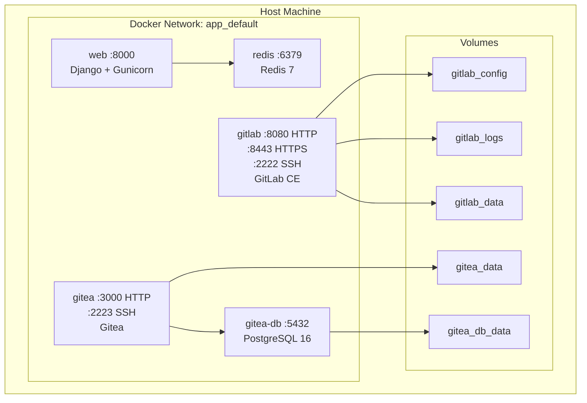
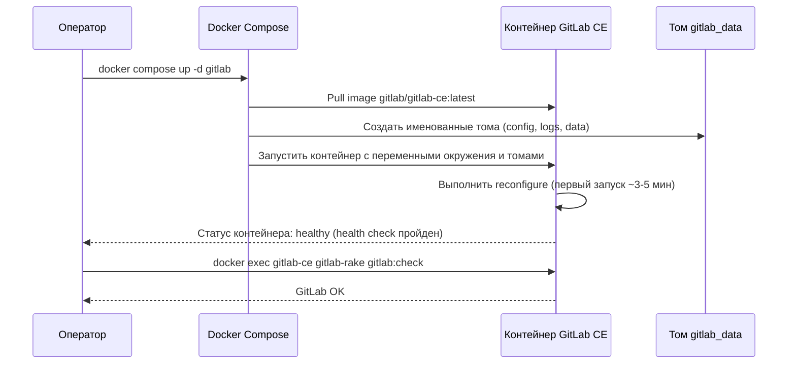
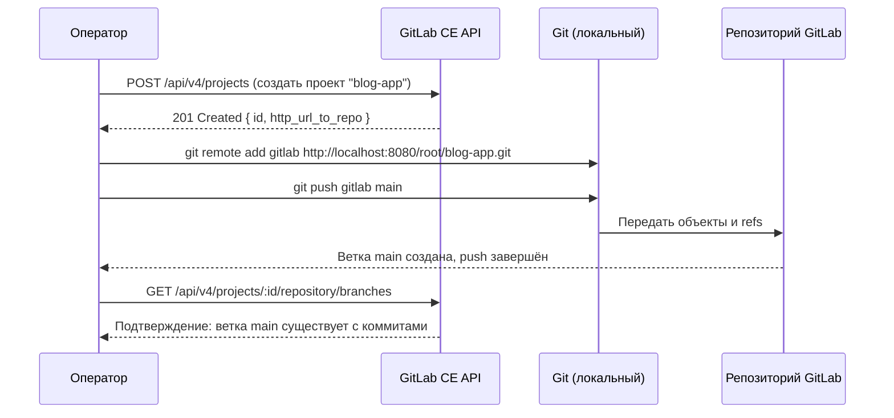
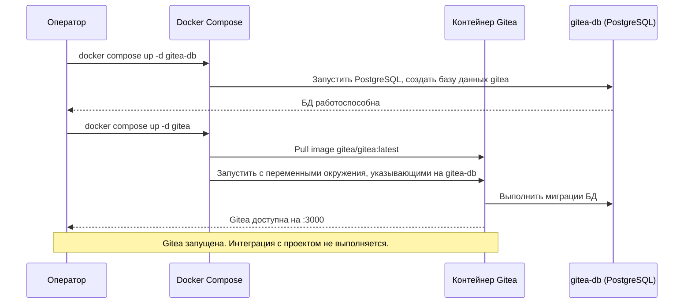

# Проектный документ: Настройка GitLab и Gitea

## Обзор

Данная функциональность добавляет два самостоятельно размещаемых Git-сервиса — GitLab CE и Gitea — в существующую инфраструктуру Docker Compose, развёртываемых последовательно. Область применения каждого сервиса намеренно разграничена:

**GitLab CE** — основная платформа: запускается как Docker-сервис, после чего текущий проект (Django + Next.js блог-приложение в корне рабочего пространства) публикуется в репозиторий на локальном экземпляре GitLab. Это включает создание проекта через GitLab API, инициализацию git-удалённого репозитория, указывающего на локальный GitLab, и push существующей кодовой базы.

**Gitea** — только запуск сервиса: запускается как Docker-контейнер и становится доступной по адресу `http://localhost:3000`. Никакой интеграции с текущим проектом, зеркалирования или связи с кодовой базой не предусмотрено.

Последовательное развёртывание обусловлено архитектурным решением: GitLab требует больше ресурсов и более длительного времени инициализации, поэтому он проверяется и подтверждается как работоспособный до введения Gitea.

Оба сервиса работают как изолированные Docker-службы рядом с существующими контейнерами `web` и `redis`, каждый доступен на отдельных портах с постоянным хранилищем на именованных томах.

## Архитектура



## Диаграммы последовательности

### Фаза 1: Запуск GitLab



### Фаза 1б: Push текущего проекта в GitLab



### Фаза 2: Запуск Gitea (только сервис)



## Компоненты и интерфейсы

### Компонент 1: Сервис GitLab CE

**Назначение**: Полнофункциональная самостоятельно размещаемая Git-платформа. После запуска в неё публикуется текущий проект (Django + Next.js блог-приложение).

**Интерфейс**:
```yaml
# определение сервиса в docker-compose.yml
gitlab:
  image: gitlab/gitlab-ce:latest
  container_name: gitlab-ce
  hostname: gitlab.localhost
  ports:
    - "8080:80"    # HTTP веб-интерфейс
    - "8443:443"   # HTTPS веб-интерфейс
    - "2222:22"    # SSH git-операции
  environment:
    GITLAB_OMNIBUS_CONFIG: |
      external_url 'http://gitlab.localhost:8080'
      gitlab_rails['gitlab_shell_ssh_port'] = 2222
      gitlab_rails['time_zone'] = 'UTC'
  volumes:
    - gitlab_config:/etc/gitlab
    - gitlab_logs:/var/log/gitlab
    - gitlab_data:/var/opt/gitlab
  healthcheck:
    test: ["CMD", "curl", "-f", "http://localhost/-/health"]
    interval: 60s
    timeout: 10s
    retries: 10
    start_period: 300s
  shm_size: 256m
```

**Обязанности**:
- Обслуживать Git-репозитории по HTTP и SSH
- Предоставлять веб-интерфейс для управления репозиториями, MR, задачами и CI/CD-пайплайнами
- Сохранять все данные в именованных Docker-томах
- Принимать push текущего проекта через REST API и git-операции

### Компонент 1б: Интеграция проекта с GitLab

**Назначение**: Публикация существующей кодовой базы в репозиторий на локальном GitLab CE.

**Интерфейс**:
```bash
# Создание проекта через GitLab API
curl --request POST \
  --header "PRIVATE-TOKEN: <root_token>" \
  --header "Content-Type: application/json" \
  --data '{"name": "blog-app", "visibility": "private"}' \
  http://localhost:8080/api/v4/projects

# Добавление удалённого репозитория и push
git remote add gitlab http://root:<password>@localhost:8080/root/blog-app.git
git push gitlab main
```

**Обязанности**:
- Создать проект `blog-app` в GitLab через REST API
- Добавить git-remote `gitlab`, указывающий на локальный GitLab
- Выполнить push всех существующих коммитов и веток

### Компонент 2: Сервис Gitea

**Назначение**: Лёгкий самостоятельно размещаемый Git-сервис. Запускается как изолированный Docker-контейнер без какой-либо интеграции с текущим проектом.

**Интерфейс**:
```yaml
gitea:
  image: gitea/gitea:latest
  container_name: gitea
  ports:
    - "3000:3000"  # HTTP веб-интерфейс
    - "2223:22"    # SSH git-операции
  environment:
    - USER_UID=1000
    - USER_GID=1000
    - GITEA__database__DB_TYPE=postgres
    - GITEA__database__HOST=gitea-db:5432
    - GITEA__database__NAME=gitea
    - GITEA__database__USER=gitea
    - GITEA__database__PASSWD=gitea_password
    - GITEA__server__DOMAIN=localhost
    - GITEA__server__HTTP_PORT=3000
    - GITEA__server__SSH_PORT=2223
    - GITEA__server__ROOT_URL=http://localhost:3000/
  volumes:
    - gitea_data:/data
  depends_on:
    gitea-db:
      condition: service_healthy
```

**Обязанности**:
- Быть доступной по адресу `http://localhost:3000` после запуска
- Не взаимодействовать с текущим проектом и не хранить его код

### Компонент 3: База данных Gitea (PostgreSQL)

**Назначение**: Выделенный экземпляр PostgreSQL для хранения метаданных Gitea.

**Интерфейс**:
```yaml
gitea-db:
  image: postgres:16-alpine
  container_name: gitea-db
  environment:
    POSTGRES_USER: gitea
    POSTGRES_PASSWORD: gitea_password
    POSTGRES_DB: gitea
  volumes:
    - gitea_db_data:/var/lib/postgresql/data
  healthcheck:
    test: ["CMD-SHELL", "pg_isready -U gitea"]
    interval: 10s
    timeout: 5s
    retries: 5
```

## Модели данных

### Структура томов GitLab

```
gitlab_config  -> /etc/gitlab        (конфигурация omnibus, SSL-сертификаты)
gitlab_logs    -> /var/log/gitlab    (логи сервисов)
gitlab_data    -> /var/opt/gitlab    (репозитории, БД, артефакты, реестр)
```

### Структура томов Gitea

```
gitea_data     -> /data              (репозитории, конфигурация, вложения, SSH-ключи)
gitea_db_data  -> /var/lib/postgresql/data  (файлы данных PostgreSQL)
```

### Переменные окружения

```
# GitLab (через GITLAB_OMNIBUS_CONFIG)
external_url                    string   Полный URL, по которому доступен GitLab
gitlab_shell_ssh_port           int      SSH-порт, открытый на хосте (2222)
time_zone                       string   UTC

# Gitea (через environment)
GITEA__database__DB_TYPE        string   postgres
GITEA__database__HOST           string   gitea-db:5432
GITEA__database__NAME           string   gitea
GITEA__database__USER           string   gitea
GITEA__database__PASSWD         string   gitea_password
GITEA__server__DOMAIN           string   localhost
GITEA__server__ROOT_URL         string   http://localhost:3000/
GITEA__server__SSH_PORT         int      2223
```

## Алгоритмический псевдокод

### Алгоритм последовательной настройки

```pascal
ALGORITHM setupGitServices()
INPUT: docker-compose.yml с определениями сервисов gitlab и gitea
OUTPUT: оба сервиса запущены; текущий проект опубликован в GitLab

BEGIN
  // Фаза 1: GitLab
  PROCEDURE setupGitLab()
    SEQUENCE
      run("docker compose up -d gitlab")

      WHILE NOT gitLabHealthy() DO
        WAIT 30 секунд
        IF waitTime > 600 секунд THEN
          RAISE Error("GitLab не запустился в течение 10 минут")
        END IF
      END WHILE

      result <- run("docker exec gitlab-ce gitlab-rake gitlab:check")
      IF result.exitCode != 0 THEN
        RAISE Error("Проверка работоспособности GitLab не пройдена")
      END IF

      DISPLAY "GitLab готов по адресу http://localhost:8080"
    END SEQUENCE
  END PROCEDURE

  // Фаза 1б: Push текущего проекта в GitLab
  PROCEDURE pushProjectToGitLab(rootToken)
    SEQUENCE
      response <- httpPost(
        url     = "http://localhost:8080/api/v4/projects",
        headers = {"PRIVATE-TOKEN": rootToken},
        body    = {"name": "blog-app", "visibility": "private"}
      )
      IF response.statusCode != 201 THEN
        RAISE Error("Не удалось создать проект в GitLab: " + response.body)
      END IF

      IF "gitlab" IN run("git remote").output THEN
        run("git remote set-url gitlab " + response.body.http_url_to_repo)
      ELSE
        run("git remote add gitlab " + response.body.http_url_to_repo)
      END IF

      currentBranch <- run("git rev-parse --abbrev-ref HEAD").output.trim()
      run("git push gitlab " + currentBranch)

      DISPLAY "Проект опубликован: " + response.body.http_url_to_repo
    END SEQUENCE
  END PROCEDURE

  // Фаза 2: Gitea (только запуск сервиса)
  PROCEDURE setupGitea()
    SEQUENCE
      run("docker compose up -d gitea-db")

      WHILE NOT giteaDbHealthy() DO
        WAIT 5 секунд
      END WHILE

      run("docker compose up -d gitea")

      WHILE NOT giteaHealthy() DO
        WAIT 5 секунд
        IF waitTime > 120 секунд THEN
          RAISE Error("Gitea не запустилась в течение 2 минут")
        END IF
      END WHILE

      DISPLAY "Gitea готова по адресу http://localhost:3000"
      // Интеграция с проектом не выполняется
    END SEQUENCE
  END PROCEDURE

  setupGitLab()
  rootToken <- getGitLabRootToken()
  pushProjectToGitLab(rootToken)
  setupGitea()
END
```

**Предусловия:**
- Docker Engine >= 20.10 и Docker Compose v2 установлены
- Порты 8080, 8443, 2222, 3000, 2223 свободны на хосте
- Доступно не менее 6 ГБ оперативной памяти
- Рабочий каталог является git-репозиторием с хотя бы одним коммитом

**Постусловия:**
- GitLab CE доступен по адресу `http://localhost:8080`
- Gitea доступна по адресу `http://localhost:3000`
- Проект `blog-app` существует в GitLab с полной историей коммитов
- Gitea не содержит репозиториев, связанных с текущим проектом

### Алгоритм проверки работоспособности

```pascal
FUNCTION gitLabHealthy() -> boolean
  response <- httpGet("http://localhost:8080/-/health")
  RETURN response.statusCode = 200
END FUNCTION

FUNCTION giteaDbHealthy() -> boolean
  result <- run("docker exec gitea-db pg_isready -U gitea")
  RETURN result.exitCode = 0
END FUNCTION

FUNCTION giteaHealthy() -> boolean
  response <- httpGet("http://localhost:3000")
  RETURN response.statusCode IN {200, 302}
END FUNCTION
```

## Ключевые функции с формальными спецификациями

### Функция 1: Получение начального пароля GitLab

```pascal
PROCEDURE getGitLabInitialPassword()
  INPUT: запущенный контейнер gitlab-ce
  OUTPUT: строка с начальным паролем root
```

**Предусловия:** контейнер `gitlab-ce` работоспособен, `reconfigure` завершён
**Постусловия:** возвращает пароль из `/etc/gitlab/initial_root_password`; файл удаляется через 24 часа

### Функция 2: Получение токена доступа GitLab

```pascal
PROCEDURE getGitLabRootToken() -> string
  INPUT: работоспособный GitLab CE
  OUTPUT: Personal Access Token пользователя root
```

**Предусловия:** GitLab работоспособен, пароль root известен
**Постусловия:** возвращает токен с правами `api` и `write_repository`

```bash
# Создание токена через Rails console
docker exec -it gitlab-ce gitlab-rails runner \
  "token = User.find_by_username('root').personal_access_tokens.create(scopes: ['api'], name: 'setup-token', expires_at: 1.day.from_now); puts token.token"
```

### Функция 3: Публикация проекта в GitLab

```pascal
PROCEDURE pushProjectToGitLab(rootToken: string)
  INPUT: Personal Access Token пользователя root
  OUTPUT: кодовая база опубликована в репозитории GitLab
```

**Предусловия:** GitLab работоспособен; токен имеет права `api` и `write_repository`; рабочий каталог является git-репозиторием с коммитами
**Постусловия:** проект `blog-app` существует в GitLab; remote `gitlab` добавлен локально; все коммиты текущей ветки присутствуют в GitLab

## Пример использования

```bash
# Шаг 1: Запустить GitLab
docker compose up -d gitlab
docker compose logs -f gitlab  # ждём ~3-5 минут

# Шаг 2: Получить начальный пароль root
docker exec gitlab-ce cat /etc/gitlab/initial_root_password
# Войти на http://localhost:8080, сменить пароль

# Шаг 3: Создать токен и опубликовать проект
docker exec -it gitlab-ce gitlab-rails runner \
  "token = User.find_by_username('root').personal_access_tokens.create(scopes: ['api'], name: 'setup-token', expires_at: 1.day.from_now); puts token.token"

curl --request POST \
  --header "PRIVATE-TOKEN: <token>" \
  --data "name=blog-app&visibility=private" \
  http://localhost:8080/api/v4/projects

git remote add gitlab http://root:<password>@localhost:8080/root/blog-app.git
git push gitlab main

# Шаг 4: Запустить Gitea (только сервис, без интеграции с проектом)
docker compose up -d gitea-db gitea
# Завершить веб-установщик на http://localhost:3000

# Шаг 5: Проверить оба сервиса
docker compose ps
curl -f http://localhost:8080/-/health
curl -f http://localhost:3000/api/healthz
```

## Свойства корректности

*Свойство — это характеристика или поведение, которое должно выполняться при всех допустимых запусках системы. Свойства служат мостом между читаемыми человеком спецификациями и машинно-верифицируемыми гарантиями корректности.*

### Свойство 1: Уникальность портов хоста

*Для любого* набора сервисов в `docker-compose.yml` все маппинги портов хоста должны быть уникальными — ни один порт хоста не должен быть назначен более чем одному сервису.

**Validates: Requirements 11.1**

---

### Свойство 2: Сохранность коммитов при push (round-trip)

*Для любого* локального git-репозитория с N коммитами: после выполнения `git push gitlab <branch>` количество коммитов в соответствующей ветке на GitLab CE должно быть равно N (результату `git rev-list --count HEAD`).

**Validates: Requirements 6.4**

---

### Свойство 3: Постоянство данных GitLab при перезапуске (round-trip)

*Для любого* состояния репозиториев и конфигурации GitLab CE: после перезапуска контейнера `gitlab-ce` все данные, хранившиеся в именованных томах `gitlab_config`, `gitlab_logs`, `gitlab_data`, должны быть идентичны данным до перезапуска.

**Validates: Requirements 12.1**

---

### Свойство 4: Постоянство данных Gitea при перезапуске (round-trip)

*Для любого* состояния данных Gitea: после перезапуска контейнера `gitea` все данные тома `gitea_data` должны быть идентичны данным до перезапуска. Аналогично, после перезапуска `gitea-db` все данные тома `gitea_db_data` должны быть сохранены.

**Validates: Requirements 12.2, 12.3**

---

### Свойство 5: Изоляция Gitea от проекта

*Для любого* завершённого состояния настройки: Gitea не должна содержать ни одного репозитория, связанного с проектом `blog-app`, а локальный список git-remote не должен включать remote, указывающий на Gitea.

**Validates: Requirements 10.1, 10.2**

---

### Свойство 6: Ответ GitLab API при ошибке содержит описание

*Для любого* запроса к GitLab API, завершившегося со статусом, отличным от 2xx: тело ответа должно содержать поле с описанием ошибки, достаточным для диагностики проблемы.

**Validates: Requirements 5.3**

## Обработка ошибок

### Сценарий 1: Таймаут запуска GitLab

**Условие**: контейнер не достигает healthy в течение 10 минут
**Восстановление**: увеличить память Docker до >=4 ГБ; `docker compose down gitlab && docker compose up -d gitlab`

### Сценарий 2: Ошибка подключения Gitea к БД

**Условие**: Gitea не может подключиться к `gitea-db`
**Восстановление**: проверить `GITEA__database__*` переменные; убедиться, что `gitea-db` healthy

### Сценарий 3: Порт уже занят

**Условие**: порт 8080, 3000, 2222 или 2223 занят
**Восстановление**: изменить маппинг в `docker-compose.yml`; обновить `external_url` / `ROOT_URL`

### Сценарий 4: Ошибка push проекта

**Условие**: `git push gitlab main` завершается с ошибкой аутентификации
**Восстановление**: проверить правильность пароля в URL remote; убедиться, что токен имеет права `write_repository`

## Стратегия тестирования

### Модульное тестирование

- `docker compose config` — проверка синтаксиса compose-файла
- Проверка отсутствия конфликтов портов в маппингах `ports`
- Проверка наличия всех переменных окружения в определениях сервисов

### Интеграционное тестирование

1. `curl -f http://localhost:8080/-/health` → 200
2. `curl http://localhost:8080/api/v4/projects/root%2Fblog-app --header "PRIVATE-TOKEN: <token>"` → 200
3. Количество коммитов в GitLab совпадает с `git rev-list --count HEAD`
4. `curl -f http://localhost:3000/api/healthz` → `{"status":"pass"}`
5. Gitea не содержит репозиторий `blog-app`

## Соображения о производительности

- GitLab CE: минимум 4 ГБ RAM, 2 CPU; рекомендуется 6 ГБ
- Gitea: ~100 МБ RAM, специальных требований нет
- Первый запуск GitLab: 3-5 минут; последующие перезапуски: ~60 секунд
- `shm_size: 256m` для GitLab обязателен во избежание ошибок разделяемой памяти

## Соображения о безопасности

- Сменить пароль `root` GitLab сразу после первого входа
- Не открывать порты в публичный интернет без обратного прокси и TLS
- Хранить `GITEA__database__PASSWD` и другие секреты в `.env` (уже в `.gitignore`)

## Зависимости

| Зависимость | Версия | Назначение |
|---|---|---|
| `gitlab/gitlab-ce` | latest | Docker-образ GitLab CE |
| `gitea/gitea` | latest | Docker-образ Gitea |
| `postgres` | 16-alpine | База данных метаданных Gitea |
| Docker Engine | >= 20.10 | Среда выполнения контейнеров |
| Docker Compose | v2 | Оркестрация нескольких контейнеров |
