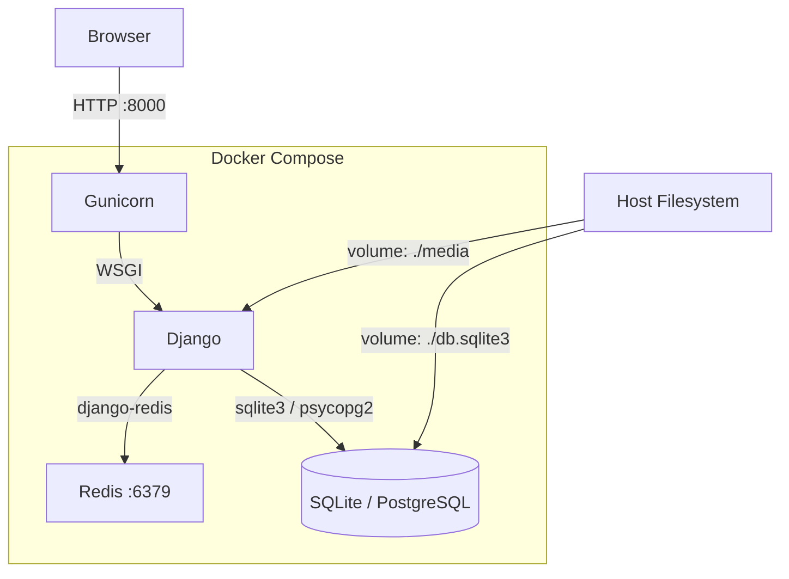
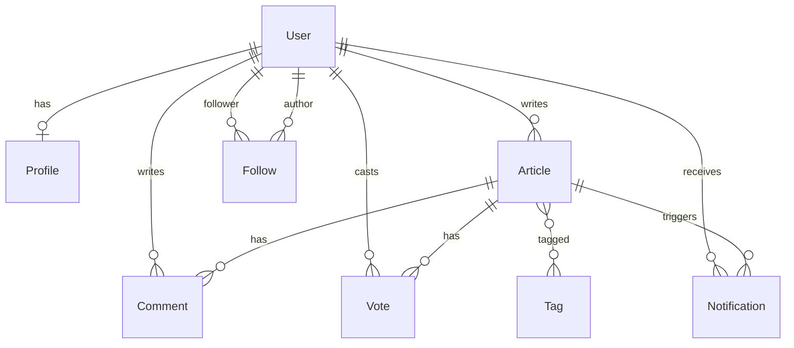

# Дизайн: Клон Хабра

## Обзор

Платформа для технических блогов на базе Django, развёртываемая через Docker Compose одной командой `docker compose up --build`. Стек: Django + Gunicorn (web), Redis (кэш), SQLite (dev) / PostgreSQL (prod). Все сервисы изолированы в контейнерах, конфигурация передаётся через переменные окружения.

Приоритет дизайна: сначала Docker-инфраструктура, затем приложение поверх неё.

---

## Архитектура



**Поток запроса:**
1. Браузер → Gunicorn (порт 8000)
2. Gunicorn → Django view
3. Django проверяет Redis-кэш; при промахе — запрос к БД, результат кладётся в кэш
4. Ответ возвращается браузеру

**Сервисы Docker Compose:**

| Сервис | Образ | Порт | Роль |
|--------|-------|------|------|
| `web` | собирается из Dockerfile | 8000 | Django + Gunicorn |
| `redis` | `redis:7-alpine` | 6379 | Кэш |
| `db` | `postgres:16-alpine` (prod) / volume SQLite (dev) | 5432 | База данных |

---

## Компоненты и интерфейсы

### Docker-инфраструктура

**Dockerfile** (`/Dockerfile`):
- Базовый образ: `python:3.12-slim`
- Двухэтапное копирование: сначала `requirements.txt` (кэш слоя), затем код
- `collectstatic --noinput` на этапе сборки
- `ENV PYTHONUNBUFFERED=1`
- `EXPOSE 8000`
- CMD: `gunicorn mysite.wsgi:application --bind 0.0.0.0:8000 --workers 2`

**docker-compose.yml** (`/docker-compose.yml`):
```yaml
services:
  redis:
    image: redis:7-alpine
    restart: always
    command: >
      redis-server
      --maxmemory 256mb
      --maxmemory-policy allkeys-lru
      --save ""
    ports:
      - "6379:6379"

  web:
    build: .
    restart: always
    ports:
      - "8000:8000"
    env_file:
      - .env
    volumes:
      - ./media:/app/media
      - ./db.sqlite3:/app/db.sqlite3
      - ./staticfiles:/app/staticfiles
    depends_on:
      - redis
    command: >
      sh -c "python manage.py migrate &&
             gunicorn mysite.wsgi:application --bind 0.0.0.0:8000 --workers 2"
```

**.dockerignore** (`/.dockerignore`):
```
.venv
__pycache__
*.pyc
*.pyo
.git
.gitignore
db.sqlite3
media/
Plan/
```

**.env.example** (`/.env.example`):
```env
SECRET_KEY=your-secret-key-here
DEBUG=True
ALLOWED_HOSTS=localhost,127.0.0.1
REDIS_URL=redis://redis:6379/1
DATABASE_URL=sqlite:///db.sqlite3
```

### Django-приложение

**Структура проекта:**
```
mysite/
  settings.py      # конфигурация из env vars
  urls.py          # корневые URL
  wsgi.py
blog/
  models.py        # все модели
  views.py         # все views
  forms.py         # формы
  urls.py          # URL приложения
  context_processors.py  # счётчик уведомлений
  templatetags/
    markdown_extras.py   # фильтр markdown
  templates/
    blog/
      base.html
      article_list.html
      article_detail.html
      article_form.html
      profile.html
      notifications.html
      feed.html
    registration/
      login.html
```

**settings.py — ключевые секции:**
```python
import os
SECRET_KEY = os.environ.get('SECRET_KEY', 'insecure-dev-key')
DEBUG = os.environ.get('DEBUG', 'True') == 'True'
ALLOWED_HOSTS = os.environ.get('ALLOWED_HOSTS', 'localhost,127.0.0.1').split(',')
REDIS_URL = os.environ.get('REDIS_URL', 'redis://127.0.0.1:6379/1')

CACHES = {
    "default": {
        "BACKEND": "django_redis.cache.RedisCache",
        "LOCATION": REDIS_URL,
        "OPTIONS": {
            "CLIENT_CLASS": "django_redis.client.DefaultClient",
            "SOCKET_CONNECT_TIMEOUT": 5,
            "SOCKET_TIMEOUT": 5,
        }
    }
}
DJANGO_REDIS_IGNORE_EXCEPTIONS = True

STATIC_ROOT = BASE_DIR / 'staticfiles'
MEDIA_ROOT = BASE_DIR / 'media'
MEDIA_URL = '/media/'
```

### Кэширование Redis

Схема ключей:

| Ключ | Содержимое | TTL |
|------|-----------|-----|
| `article:<slug>` | объект статьи | 300 сек |
| `article_list:<sort>:<tag>:<page>` | страница списка | 60 сек |

Инвалидация кэша происходит при: редактировании статьи, удалении, голосовании, добавлении/удалении комментария.

---

## Модели данных



### Profile
| Поле | Тип | Описание |
|------|-----|---------|
| user | OneToOneField(User) | связь с User |
| avatar | ImageField(upload_to='avatars/') | аватар |
| bio | TextField(blank=True) | биография |

### Tag
| Поле | Тип | Описание |
|------|-----|---------|
| name | CharField(max_length=50, unique=True) | название |
| slug | SlugField(unique=True) | URL-идентификатор |

### Article
| Поле | Тип | Описание |
|------|-----|---------|
| title | CharField(max_length=255) | заголовок |
| slug | SlugField(unique=True) | URL-идентификатор |
| author | ForeignKey(User) | автор |
| content | TextField | контент в Markdown |
| tags | ManyToManyField(Tag) | теги |
| status | CharField choices=[draft, published] | статус |
| views | PositiveIntegerField(default=0) | просмотры |
| created_at | DateTimeField(auto_now_add=True) | дата создания |
| updated_at | DateTimeField(auto_now=True) | дата обновления |

Метод `rating()` → `votes.filter(value=1).count() - votes.filter(value=-1).count()`

Метод `save()` → автогенерация уникального slug из заголовка через `python-slugify`; при коллизии добавляется суффикс `-1`, `-2`, ...

### Comment
| Поле | Тип | Описание |
|------|-----|---------|
| article | ForeignKey(Article) | статья |
| author | ForeignKey(User) | автор |
| content | TextField | текст |
| created_at | DateTimeField(auto_now_add=True) | дата |

`Meta.ordering = ['created_at']` — хронологический порядок.

### Vote
| Поле | Тип | Описание |
|------|-----|---------|
| article | ForeignKey(Article) | статья |
| user | ForeignKey(User) | пользователь |
| value | SmallIntegerField choices=[1, -1] | голос |

`Meta.unique_together = ('article', 'user')` — один голос на статью.

### Follow
| Поле | Тип | Описание |
|------|-----|---------|
| follower | ForeignKey(User, related_name='following') | подписчик |
| author | ForeignKey(User, related_name='followers') | автор |

`Meta.unique_together = ('follower', 'author')`.

### Notification
| Поле | Тип | Описание |
|------|-----|---------|
| recipient | ForeignKey(User) | получатель |
| actor | ForeignKey(User) | инициатор |
| article | ForeignKey(Article) | статья |
| is_read | BooleanField(default=False) | прочитано |
| created_at | DateTimeField(auto_now_add=True) | дата |

`Meta.ordering = ['-created_at']`.

---

## Correctness Properties

*A property is a characteristic or behavior that should hold true across all valid executions of a system — essentially, a formal statement about what the system should do. Properties serve as the bridge between human-readable specifications and machine-verifiable correctness guarantees.*

### Property 1: Slug содержит только допустимые символы

*Для любого* заголовка статьи сгенерированный slug должен соответствовать паттерну `^[a-z0-9][a-z0-9-]*[a-z0-9]$` (только строчные ASCII-буквы, цифры и дефисы).

**Validates: Requirements 16.1**

### Property 2: Slug уникален при коллизии заголовков

*Для любых* двух статей с одинаковым заголовком их slug-и должны быть различны.

**Validates: Requirements 6.2, 16.2**

### Property 3: Обратное преобразование Slug → Статья

*Для любой* опубликованной статьи: сгенерировать slug из заголовка, затем найти статью по этому slug — должна вернуться исходная статья.

**Validates: Requirements 16.3**

### Property 4: Переменные окружения читаются с безопасными значениями по умолчанию

*Для каждой* из переменных `SECRET_KEY`, `DEBUG`, `ALLOWED_HOSTS`, `REDIS_URL`: при отсутствии переменной в окружении Django должен использовать безопасное значение по умолчанию, не вызывая исключения при старте.

**Validates: Requirements 3.2, 3.3**

### Property 5: Разбор ALLOWED_HOSTS по запятым

*Для любой* строки вида `"host1,host2,...,hostN"` в переменной `ALLOWED_HOSTS` результирующий список `settings.ALLOWED_HOSTS` должен содержать ровно N элементов, совпадающих с исходными хостами.

**Validates: Requirements 3.5**

### Property 6: Кэш статьи — round trip

*Для любой* опубликованной статьи: после первого запроса (cache miss) статья должна быть в кэше с TTL ≤ 300 секунд; повторный запрос должен вернуть тот же объект из кэша без обращения к БД.

**Validates: Requirements 4.1, 4.2**

### Property 7: Кэш списка статей — round trip

*Для любой* комбинации (sort, tag, page): после первого запроса страница списка должна быть в кэше с TTL ≤ 60 секунд; повторный запрос должен вернуть тот же результат из кэша.

**Validates: Requirements 4.3, 4.4**

### Property 8: Инвалидация кэша при мутации статьи

*Для любой* статьи: после любой мутации (редактирование, удаление, голосование, добавление/удаление комментария) запись кэша для slug этой статьи должна отсутствовать в Redis.

**Validates: Requirements 4.5, 4.6, 4.7**

### Property 9: Регистрация создаёт пользователя и профиль

*Для любых* валидных данных регистрации: после успешной отправки формы должны существовать запись `User` и связанная запись `Profile`.

**Validates: Requirements 5.1, 10.3**

### Property 10: Защита от несанкционированного доступа

*Для любого* защищённого URL: запрос от неаутентифицированного пользователя должен возвращать редирект на страницу входа (HTTP 302 с Location, содержащим `/accounts/login/`).

**Validates: Requirements 5.6**

### Property 11: Владелец статьи — единственный редактор

*Для любой* статьи и любого пользователя, не являющегося её автором: запрос на редактирование или удаление должен возвращать HTTP 404.

**Validates: Requirements 6.7**

### Property 12: Счётчик просмотров увеличивается только для не-авторов

*Для любой* опубликованной статьи: просмотр страницы не-автором должен увеличивать `views` ровно на 1; просмотр автором не должен изменять `views`.

**Validates: Requirements 6.4**

### Property 13: Теги корректно парсятся и связываются

*Для любой* строки тегов через запятую: каждый непустой тег после trim должен существовать в БД и быть связан со статьёй; дубликаты в строке не должны создавать дублирующих связей.

**Validates: Requirements 7.1**

### Property 14: Фильтрация по тегу возвращает только статьи с этим тегом

*Для любого* тега: список статей, отфильтрованный по этому тегу, должен содержать только статьи, у которых данный тег присутствует, и не содержать статей без него.

**Validates: Requirements 7.2**

### Property 15: Комментарии отображаются в хронологическом порядке

*Для любой* статьи с N комментариями: список комментариев должен быть упорядочен по `created_at` по возрастанию (каждый следующий комментарий не старше предыдущего).

**Validates: Requirements 8.2**

### Property 16: Владелец комментария — единственный удалитель

*Для любого* комментария и любого пользователя, не являющегося его автором: запрос на удаление должен возвращать HTTP 404.

**Validates: Requirements 8.4**

### Property 17: Голосование — полная семантика

*Для любой* статьи и любого не-автора:
- первый голос (value=1 или -1) создаёт запись Vote;
- повторный голос с тем же значением удаляет запись (toggle);
- голос с противоположным значением обновляет запись.

**Validates: Requirements 9.1, 9.2, 9.3**

### Property 18: Рейтинг = upvotes − downvotes

*Для любого* набора голосов на статью: `article.rating()` должен равняться количеству голосов со значением 1 минус количество голосов со значением -1.

**Validates: Requirements 9.4**

### Property 19: Автор не может голосовать за свою статью

*Для любой* статьи: попытка автора проголосовать не должна создавать запись Vote.

**Validates: Requirements 9.5**

### Property 20: Подписка — toggle

*Для любых* двух различных пользователей A и B: подписка A на B создаёт запись Follow; повторная подписка удаляет её. Самоподписка не создаёт запись Follow.

**Validates: Requirements 11.1, 11.2, 11.3**

### Property 21: Лента содержит только статьи подписанных авторов

*Для любого* пользователя: его лента должна содержать только опубликованные статьи авторов, на которых он подписан, упорядоченные по `created_at` по убыванию.

**Validates: Requirements 11.5**

### Property 22: Уведомление создаётся при комментарии не-автора

*Для любой* статьи и любого комментатора, не являющегося автором статьи: после сохранения комментария должна существовать запись Notification для автора статьи.

**Validates: Requirements 12.1**

### Property 23: Просмотр уведомлений помечает их прочитанными

*Для любого* пользователя с N непрочитанными уведомлениями: после запроса страницы уведомлений все N записей должны иметь `is_read=True`.

**Validates: Requirements 12.2, 12.3**

### Property 24: Поиск возвращает только совпадающие статьи без дублей

*Для любого* поискового запроса q: каждая статья в результатах должна содержать q (без учёта регистра) в заголовке, контенте или хотя бы одном теге; результаты не должны содержать дублирующихся статей.

**Validates: Requirements 13.1**

### Property 25: Инвариант сортировки

*Для любого* списка опубликованных статей:
- sort=`new` → каждая статья не новее предыдущей (`created_at[i] >= created_at[i+1]`);
- sort=`rating` → каждая статья имеет рейтинг ≥ рейтинга следующей;
- sort=`popular` → каждая статья имеет `views` ≥ `views` следующей.

**Validates: Requirements 13.2, 13.3, 13.4**

### Property 26: Пагинация — не более 10 статей на страницу

*Для любой* страницы списка статей: количество статей на странице должно быть ≤ 10.

**Validates: Requirements 13.5**

### Property 27: Параметры сохраняются в ссылках пагинации

*Для любой* комбинации (q, tag, sort): ссылки на следующую/предыдущую страницу должны содержать все три параметра с теми же значениями.

**Validates: Requirements 13.6**

### Property 28: Markdown рендерится в HTML, исходник хранится в БД

*Для любого* контента статьи в формате Markdown: поле `content` в БД должно содержать исходный Markdown (не HTML); отрендеренный HTML должен содержать теги `<code>` для fenced code blocks и `<table>` для таблиц.

**Validates: Requirements 14.1, 14.2**

---

## Обработка ошибок

| Ситуация | Поведение |
|----------|-----------|
| Redis недоступен | `DJANGO_REDIS_IGNORE_EXCEPTIONS=True` — Django продолжает работу, обращаясь к БД |
| Статья не найдена | `get_object_or_404` → HTTP 404 |
| Доступ к чужой статье/комментарию | `get_object_or_404(Article, slug=slug, author=request.user)` → HTTP 404 |
| Неаутентифицированный доступ к защищённым views | `@login_required` → редирект на `/accounts/login/` |
| Дублирующийся slug | цикл с суффиксом `-1`, `-2`, ... до уникального значения |
| Самоподписка / самоголосование | редирект без создания записи |
| Пустой комментарий | валидация формы Django — форма не сохраняется |
| Переменная окружения отсутствует | `os.environ.get(key, default)` — используется безопасное значение по умолчанию |

---

## Стратегия тестирования

### Подход

Используется двойная стратегия: **unit-тесты** для конкретных примеров и граничных случаев + **property-based тесты** для универсальных свойств.

### Инструменты

| Тип | Библиотека |
|-----|-----------|
| Unit-тесты | `pytest-django` |
| Property-based тесты | `hypothesis` (с `hypothesis-django`) |
| Покрытие | `pytest-cov` |

### Unit-тесты (конкретные примеры и граничные случаи)

- Регистрация с уже существующим именем пользователя
- Вход с неверным паролем
- Создание статьи с пустым заголовком
- Просмотр черновика не-автором → 404
- Голосование автора за свою статью → нет записи Vote
- Самоподписка → нет записи Follow
- Уведомление не создаётся, если автор комментирует свою статью
- Счётчик непрочитанных уведомлений = 0 → значок не отображается (edge case 12.4)
- Redis недоступен → сервис отвечает (edge case 1.7)
- Пустой поисковый запрос → возвращаются все статьи

### Property-based тесты (Hypothesis)

Каждый property-тест должен запускаться минимум 100 итераций (`settings.max_examples=100`).
Каждый тест помечается комментарием в формате:
`# Feature: habr-clone, Property N: <краткое описание>`

**Примеры реализации:**

```python
# Feature: habr-clone, Property 1: Slug содержит только допустимые символы
@given(st.text(min_size=1, max_size=200))
@settings(max_examples=100)
def test_slug_charset(title):
    slug = generate_slug(title)
    assert re.match(r'^[a-z0-9][a-z0-9-]*$', slug)

# Feature: habr-clone, Property 18: Рейтинг = upvotes − downvotes
@given(st.lists(st.integers(min_value=-1, max_value=1).filter(lambda x: x != 0)))
@settings(max_examples=100)
def test_rating_calculation(vote_values):
    # создать статью, добавить голоса, проверить rating()
    expected = sum(1 for v in vote_values if v == 1) - sum(1 for v in vote_values if v == -1)
    assert article.rating() == expected

# Feature: habr-clone, Property 25: Инвариант сортировки
@given(st.lists(article_strategy(), min_size=2, max_size=20))
@settings(max_examples=100)
def test_sort_invariant_new(articles):
    sorted_articles = sort_articles(articles, 'new')
    for i in range(len(sorted_articles) - 1):
        assert sorted_articles[i].created_at >= sorted_articles[i+1].created_at
```

### Структура тестов

```
tests/
  test_docker/
    test_dockerfile.py      # структурные проверки Dockerfile, .dockerignore
    test_compose.py         # структурные проверки docker-compose.yml
  test_unit/
    test_auth.py
    test_articles.py
    test_comments.py
    test_votes.py
    test_profiles.py
    test_follows.py
    test_notifications.py
    test_search.py
    test_cache.py
  test_property/
    test_slug_properties.py
    test_vote_properties.py
    test_sort_properties.py
    test_cache_properties.py
    test_search_properties.py
    test_markdown_properties.py
```
