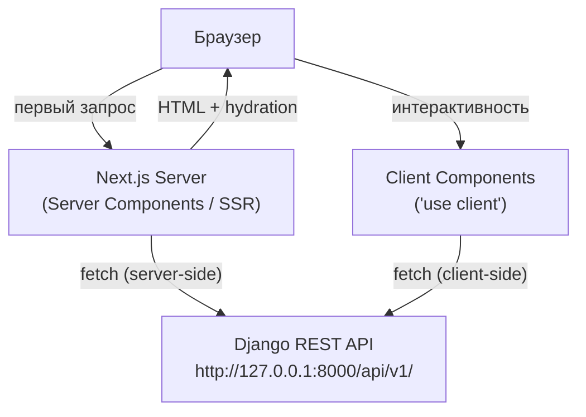
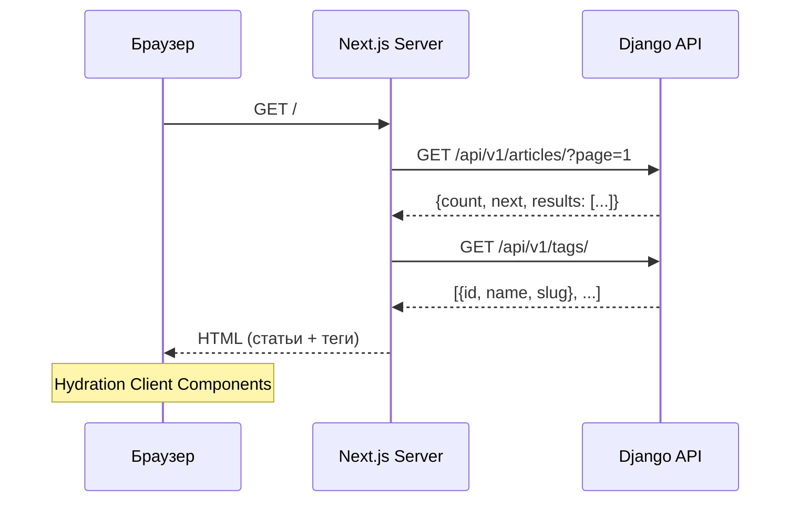
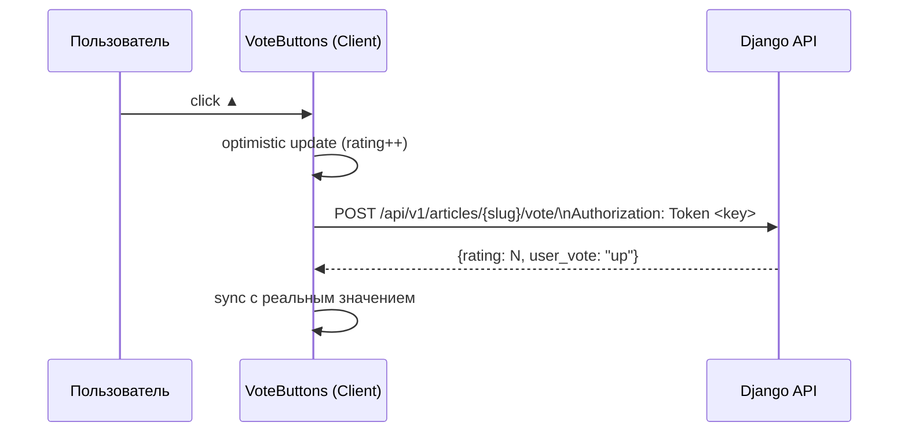

# Дизайн-документ: nextjs-frontend

## Обзор

Next.js 14 фронтенд для блог-платформы в стиле Habr/Dev.to, подключённый к существующему Django REST API (`http://127.0.0.1:8000/api/v1/`). Архитектура гибридная: ~80% страниц рендерятся на сервере (SSR/Server Components) для SEO, ~20% — клиентские компоненты для интерактивности (лайки, комментарии, поиск, уведомления). Аутентификация — Token-based (`Authorization: Token <key>`), токен хранится в `httpOnly`-куках для SSR и `localStorage` для CSR.

---

## Архитектура



### Разделение Server / Client

| Страница / Компонент | Тип | Причина |
|---|---|---|
| `page.tsx` (главная, статья, профиль, лента) | Server Component | SEO, первичная загрузка данных |
| `Navbar.tsx` | Client Component | Состояние авторизации |
| `CommentSection.tsx` | Client Component | Добавление/удаление комментариев |
| `VoteButtons.tsx` | Client Component | Toggle лайк/дизлайк |
| `FollowButton.tsx` | Client Component | Toggle подписка |
| `SearchBar.tsx` | Client Component | Управляемый input + debounce |
| `Pagination.tsx` | Server Component | Ссылки на страницы (URL params) |
| `login/page.tsx`, `register/page.tsx` | Client Component | Форма с состоянием |
| `profile/page.tsx` | Client Component | Редактирование профиля |
| `notifications/page.tsx` | Client Component | Polling / mark-read |
| `articles/new/page.tsx`, `edit/page.tsx` | Client Component | Форма создания/редактирования |

---

## Диаграммы последовательностей

### SSR-страница (главная / статья / профиль)



### Клиентское действие (лайк)



### Аутентификация

```mermaid
sequenceDiagram
    participant U as Пользователь
    participant L as LoginPage (Client)
    participant D as Django API
    participant S as Next.js Server Action

    U->>L: submit {username, password}
    L->>D: POST /api/v1/auth/login/
    D-->>L: {token, user}
    L->>S: setAuthCookie(token, user)
    S-->>L: Set-Cookie: auth_token=...; HttpOnly
    L->>L: localStorage.setItem('user', JSON)
    L-->>U: redirect → /
```

---

## Компоненты и интерфейсы

### `lib/types.ts` — TypeScript-интерфейсы

```typescript
export interface User {
  id: number
  username: string
}

export interface Tag {
  id: number
  name: string
  slug: string
}

export interface ArticleList {
  id: number
  slug: string
  title: string
  author: User
  tags: Tag[]
  status: 'draft' | 'published'
  views: number
  rating: number
  created_at: string
}

export interface ArticleDetail extends ArticleList {
  content: string
  comments: Comment[]
  updated_at: string
}

export interface Comment {
  id: number
  author: User
  content: string
  created_at: string
}

export interface Profile {
  user: User
  avatar: string | null
  bio: string
  followers_count: number
  is_following: boolean
}

export interface Notification {
  id: number
  actor: User
  article: ArticleList
  is_read: boolean
  created_at: string
}

export interface PaginatedResponse<T> {
  count: number
  next: string | null
  previous: string | null
  results: T[]
}

export interface AuthResponse {
  token: string
  user: User
}
```

### `lib/api.ts` — fetch-обёртки

```typescript
// Базовая конфигурация
const API_BASE = process.env.NEXT_PUBLIC_API_URL ?? 'http://127.0.0.1:8000/api/v1'

// Серверный fetch (Server Components) — читает токен из cookies()
async function serverFetch<T>(path: string, options?: RequestInit): Promise<T>

// Клиентский fetch (Client Components) — читает токен из localStorage
async function clientFetch<T>(path: string, options?: RequestInit): Promise<T>

// Статьи
export async function getArticles(params?: ArticleParams): Promise<PaginatedResponse<ArticleList>>
export async function getArticle(slug: string): Promise<ArticleDetail>
export async function createArticle(data: ArticleWriteData): Promise<ArticleDetail>
export async function updateArticle(slug: string, data: Partial<ArticleWriteData>): Promise<ArticleDetail>
export async function deleteArticle(slug: string): Promise<void>
export async function voteArticle(slug: string): Promise<{ rating: number }>
export async function getFeed(page?: number): Promise<PaginatedResponse<ArticleList>>

// Комментарии
export async function getComments(slug: string): Promise<Comment[]>
export async function addComment(slug: string, content: string): Promise<Comment>
export async function deleteComment(slug: string, id: number): Promise<void>

// Теги
export async function getTags(): Promise<Tag[]>

// Профили
export async function getProfile(username: string): Promise<Profile>
export async function getMyProfile(): Promise<Profile>
export async function updateMyProfile(data: ProfileUpdateData): Promise<Profile>
export async function followUser(username: string): Promise<{ is_following: boolean }>

// Уведомления
export async function getNotifications(): Promise<Notification[]>
export async function markNotificationsRead(): Promise<void>

// Аутентификация
export async function login(username: string, password: string): Promise<AuthResponse>
export async function register(username: string, password1: string, password2: string): Promise<AuthResponse>
export async function logout(): Promise<void>
export async function getMe(): Promise<User>
```

### `lib/auth.ts` — управление токеном

```typescript
// Клиентская сторона
export function getToken(): string | null          // из localStorage
export function setToken(token: string): void      // в localStorage
export function removeToken(): void                // из localStorage
export function getStoredUser(): User | null       // из localStorage

// Серверная сторона (Server Actions / Route Handlers)
export async function getServerToken(): Promise<string | null>  // из cookies()
export async function setServerToken(token: string): Promise<void>
export async function clearServerToken(): Promise<void>
```

### Компоненты

#### `Navbar.tsx` (Client)

```typescript
interface NavbarProps {}
// Читает user из localStorage, показывает: лого, поиск, ссылки
// Если авторизован: /feed, /notifications (badge), /profile, logout
// Если нет: /login, /register
```

#### `ArticleCard.tsx` (Server)

```typescript
interface ArticleCardProps {
  article: ArticleList
}
// Карточка: заголовок, автор, теги, рейтинг, дата, просмотры
```

#### `ArticleList.tsx` (Server)

```typescript
interface ArticleListProps {
  articles: ArticleList[]
}
// Рендерит список ArticleCard
```

#### `CommentSection.tsx` (Client)

```typescript
interface CommentSectionProps {
  slug: string
  initialComments: Comment[]
}
// Список комментариев + форма добавления (если авторизован)
// Оптимистичное добавление, удаление своих комментариев
```

#### `VoteButtons.tsx` (Client)

```typescript
interface VoteButtonsProps {
  slug: string
  initialRating: number
}
// Кнопки ▲/▼, текущий рейтинг, оптимистичный update
```

#### `FollowButton.tsx` (Client)

```typescript
interface FollowButtonProps {
  username: string
  initialIsFollowing: boolean
}
// Toggle подписки, disabled если не авторизован
```

#### `SearchBar.tsx` (Client)

```typescript
interface SearchBarProps {
  defaultValue?: string
}
// Управляемый input, debounce 300ms, обновляет URL ?search=
```

#### `Pagination.tsx` (Server)

```typescript
interface PaginationProps {
  count: number
  page: number
  pageSize?: number  // default 10
}
// Ссылки на страницы через URL params (?page=N)
```

---

## Модели данных

### Параметры запросов

```typescript
interface ArticleParams {
  page?: number
  search?: string
  tags__slug?: string
  author__username?: string
  ordering?: string  // '-created_at' | 'created_at' | '-rating' | 'rating'
}

interface ArticleWriteData {
  title: string
  content: string
  status: 'draft' | 'published'
  tags: string[]  // имена тегов
}

interface ProfileUpdateData {
  bio?: string
  avatar?: File | null
}
```

### Хранение состояния авторизации

```
localStorage:
  'auth_token' → string (токен)
  'auth_user'  → JSON (User объект)

Cookie (httpOnly, для SSR):
  'auth_token' → string (токен)
```

---

## Ключевые функции с формальными спецификациями

### `serverFetch<T>(path, options)`

**Предусловия:**
- `path` — непустая строка, начинается с `/`
- `API_BASE` задан в переменных окружения

**Постусловия:**
- Если ответ 2xx → возвращает `T`
- Если ответ 401/403 → бросает `ApiError` с кодом
- Если ответ 404 → бросает `NotFoundError`
- Автоматически добавляет `Authorization: Token <key>` если токен есть в cookies

**Инварианты:**
- Никогда не кэширует ответы с `Authorization` заголовком (no-store)
- Всегда устанавливает `Content-Type: application/json`

### `voteArticle(slug)`

**Предусловия:**
- Пользователь авторизован (токен в localStorage)
- `slug` — непустая строка

**Постусловия:**
- Возвращает обновлённый `rating`
- Если голос уже стоял — снимает его (toggle)
- Нельзя голосовать за свою статью → `ApiError(403)`

### `followUser(username)`

**Предусловия:**
- Пользователь авторизован
- `username` ≠ текущий пользователь

**Постусловия:**
- Возвращает `{ is_following: boolean }` — новое состояние
- Toggle: если был подписан → отписывается, и наоборот

---

## Алгоритмические псевдокоды

### Алгоритм загрузки главной страницы (SSR)

```pascal
ALGORITHM renderHomePage(searchParams)
INPUT: searchParams = {page?, search?, tags__slug?}
OUTPUT: HTML с списком статей

BEGIN
  page ← searchParams.page OR 1
  
  // Параллельные запросы к API
  PARALLEL DO
    articlesData ← getArticles({page, search, tags__slug})
    tags ← getTags()
  END PARALLEL
  
  RETURN render(
    ArticleList(articlesData.results),
    TagFilter(tags, selectedTag),
    SearchBar(search),
    Pagination(articlesData.count, page)
  )
END
```

### Алгоритм аутентификации (Client)

```pascal
ALGORITHM handleLogin(username, password)
INPUT: username: String, password: String
OUTPUT: redirect OR error

BEGIN
  setLoading(true)
  
  TRY
    response ← POST /api/v1/auth/login/ {username, password}
    
    // Сохраняем токен в двух местах
    localStorage.setItem('auth_token', response.token)
    localStorage.setItem('auth_user', JSON(response.user))
    
    // Устанавливаем httpOnly cookie через Server Action
    CALL setServerToken(response.token)
    
    redirect('/')
    
  CATCH ApiError(400)
    setError('Неверный логин или пароль')
  FINALLY
    setLoading(false)
  END TRY
END
```

### Алгоритм оптимистичного обновления (VoteButtons)

```pascal
ALGORITHM handleVote(slug, currentRating, setRating)
INPUT: slug: String, currentRating: Number
OUTPUT: обновлённый рейтинг в UI

BEGIN
  // Оптимистичное обновление
  prevRating ← currentRating
  setRating(currentRating + 1)
  
  TRY
    result ← POST /api/v1/articles/{slug}/vote/
    setRating(result.rating)  // синхронизация с сервером
    
  CATCH ApiError
    setRating(prevRating)  // откат при ошибке
  END TRY
END
```

---

## Обработка ошибок

### Сценарий 1: Истёкший / невалидный токен

**Условие:** API возвращает 401
**Ответ:** Очистить токен из localStorage и cookie, редирект на `/login`
**Восстановление:** Пользователь логинится заново

### Сценарий 2: Нет прав (403)

**Условие:** Попытка редактировать чужую статью
**Ответ:** Показать toast-уведомление "Нет прав доступа"
**Восстановление:** Пользователь остаётся на странице

### Сценарий 3: Сеть недоступна

**Условие:** `fetch` бросает `TypeError: Failed to fetch`
**Ответ:** Показать глобальный error boundary с кнопкой "Повторить"
**Восстановление:** Retry запроса

### Сценарий 4: SSR-ошибка (Server Component)

**Условие:** API недоступен при серверном рендере
**Ответ:** Next.js `error.tsx` — страница с сообщением об ошибке
**Восстановление:** Автоматический retry при следующем запросе

### Сценарий 5: Форма — ошибки валидации (400)

**Условие:** Django возвращает `{"field": ["сообщение"]}`
**Ответ:** Показать ошибки под соответствующими полями формы
**Восстановление:** Пользователь исправляет данные

---

## Стратегия тестирования

### Unit-тестирование

- `lib/api.ts` — мокировать `fetch`, проверять формирование URL, заголовков, обработку ошибок
- `lib/auth.ts` — проверять чтение/запись токена в localStorage
- Компоненты — React Testing Library, проверять рендер с разными props

### Property-Based тестирование

**Библиотека:** `fast-check`

- `PaginatedResponse<T>` — для любого `count` и `page_size`, количество страниц = `ceil(count / page_size)`
- `ArticleParams` — любая комбинация параметров формирует валидный URL без дублирования ключей
- Токен — любая строка длиной > 0 корректно сохраняется и читается из localStorage

### Интеграционное тестирование

- E2E через Playwright: login → создание статьи → лайк → logout
- MSW (Mock Service Worker) для мокирования Django API в тестах

---

## Производительность

- Server Components исключают JS-бандл для статических страниц
- `Promise.all` для параллельных API-запросов в SSR
- `next/image` для оптимизации аватаров
- Пагинация на стороне сервера (page_size=10 от Django)
- Debounce 300ms в SearchBar для снижения числа запросов
- `revalidate` тег для ISR на страницах статей (опционально)

---

## Безопасность

- Токен в `httpOnly` cookie — недоступен JS, защита от XSS
- CORS настроен на Django стороне (`localhost:3000`)
- Все мутирующие запросы (POST/PUT/DELETE) требуют токен
- Серверные Server Actions для установки/удаления cookie
- Не хранить пароли в состоянии компонентов дольше необходимого

---

## Зависимости

| Пакет | Версия | Назначение |
|---|---|---|
| `next` | 14.2.x | Фреймворк |
| `react` / `react-dom` | 18.x | UI |
| `typescript` | 5.x | Типизация |
| `bootstrap` | 5.3.x | CSS-фреймворк |
| `sass` | 1.x | SCSS-компилятор |

Дополнительные (рекомендуется установить):

| Пакет | Назначение |
|---|---|
| `@types/bootstrap` | Типы Bootstrap |
| `react-hot-toast` | Toast-уведомления |
| `fast-check` | Property-based тесты |
| `@testing-library/react` | Unit-тесты компонентов |
| `msw` | Мокирование API в тестах |

---

## Свойства корректности

*Свойство — это характеристика или поведение, которое должно выполняться при всех допустимых выполнениях системы. Свойства служат мостом между читаемыми человеком спецификациями и машинно-верифицируемыми гарантиями корректности.*

### Свойство 1: Заголовок Authorization добавляется ко всем запросам с токеном

*Для любого* непустого токена и любого пути API, если токен присутствует (в localStorage или куке), то сформированный запрос должен содержать заголовок `Authorization: Token <token>`.

**Validates: Requirements 2.1, 2.2**

---

### Свойство 2: Content-Type всегда application/json

*Для любого* пути и HTTP-метода, запрос, сформированный `API_Client`, должен содержать заголовок `Content-Type: application/json`.

**Validates: Requirements 2.3**

---

### Свойство 3: Авторизованные запросы не кэшируются

*Для любого* запроса, содержащего заголовок `Authorization`, параметр `cache` должен быть равен `'no-store'`.

**Validates: Requirements 2.4**

---

### Свойство 4: Корректное отображение HTTP-кодов ошибок

*Для любого* пути API, если Django_API возвращает HTTP 401, 403 или 404, то `API_Client` должен выбрасывать ошибку с соответствующим кодом (401 → `ApiError(401)`, 403 → `ApiError(403)`, 404 → `NotFoundError`).

**Validates: Requirements 2.5, 2.6, 2.7**

---

### Свойство 5: URL из ArticleParams не содержит дублирующихся ключей

*Для любой* комбинации полей `ArticleParams` (включая пустые и частично заполненные), сформированный URL должен содержать каждый ключ не более одного раза и включать только переданные параметры.

**Validates: Requirements 2.9**

---

### Свойство 6: Round-trip токена через localStorage

*Для любой* непустой строки токена, после вызова `setToken(token)` вызов `getToken()` должен вернуть ту же строку. После вызова `removeToken()` вызов `getToken()` должен вернуть `null`.

**Validates: Requirements 3.1, 3.4**

---

### Свойство 7: Round-trip User через localStorage

*Для любого* объекта `User`, после вызова `setToken` и сохранения пользователя, вызов `getStoredUser()` должен вернуть эквивалентный объект.

**Validates: Requirements 3.2**

---

### Свойство 8: Параметры страницы передаются в getArticles

*Для любого* значения параметров `search`, `tags__slug` и `page` в URL, Server Component главной страницы должен передавать эти значения в вызов `getArticles` без изменений.

**Validates: Requirements 4.3, 4.4, 4.5**

---

### Свойство 9: ArticleCard отображает все обязательные поля

*Для любого* объекта `ArticleList`, рендер `ArticleCard` должен содержать заголовок, имя автора, теги, рейтинг, дату создания, количество просмотров и ссылку вида `/articles/{slug}`.

**Validates: Requirements 5.1, 5.2**

---

### Свойство 10: Количество карточек соответствует количеству статей

*Для любого* массива `ArticleList[]`, количество отрендеренных `ArticleCard` должно быть равно длине массива.

**Validates: Requirements 5.3**

---

### Свойство 11: Синхронизация рейтинга после голосования

*Для любого* начального рейтинга и любого ответа Django_API с обновлённым рейтингом, после успешного запроса голосования `VoteButtons` должен отображать значение из ответа сервера, а не оптимистичное.

**Validates: Requirements 6.4**

---

### Свойство 12: Откат рейтинга при ошибке голосования

*Для любого* начального рейтинга, если запрос голосования завершается ошибкой, `VoteButtons` должен восстановить отображаемое значение рейтинга до значения, которое было до нажатия кнопки.

**Validates: Requirements 6.5**

---

### Свойство 13: Инвариант длины списка комментариев

*Для любого* начального списка комментариев: добавление комментария должно увеличивать длину списка на 1; удаление комментария должно уменьшать длину списка на 1.

**Validates: Requirements 6.7, 6.8**

---

### Свойство 14: Количество страниц пагинации

*Для любых* значений `count ≥ 0` и `pageSize > 0`, `Pagination` должен вычислять количество страниц как `Math.ceil(count / pageSize)`.

**Validates: Requirements 7.1**

---

### Свойство 15: Ссылки пагинации содержат корректный параметр ?page=N

*Для любого* номера страницы N от 1 до totalPages, ссылка на страницу N должна содержать URL-параметр `?page=N`.

**Validates: Requirements 7.2**

---

### Свойство 16: Debounce поиска — URL обновляется не чаще раза в 300мс

*Для любой* последовательности быстрых вводов в `SearchBar` (интервал < 300мс), URL-параметр `?search=` должен обновляться только один раз после последнего ввода, а не при каждом нажатии клавиши.

**Validates: Requirements 8.1, 17.4**

---

### Свойство 17: Поиск сбрасывает страницу до 1

*Для любого* нового значения поиска, после обновления `?search=` параметр `?page=` должен быть равен 1 или отсутствовать.

**Validates: Requirements 8.2**

---

### Свойство 18: SearchBar отображает значение из URL

*Для любого* значения параметра `?search=` в URL, `SearchBar` при первоначальном рендере должен отображать это значение в поле ввода.

**Validates: Requirements 8.3**

---

### Свойство 19: Ошибки валидации формы отображаются под соответствующими полями

*Для любого* объекта ошибок вида `{"field": ["message"]}`, возвращённого Django_API с HTTP 400, каждое сообщение об ошибке должно отображаться рядом с соответствующим полем формы.

**Validates: Requirements 9.6, 13.5, 15.4**

---

### Свойство 20: Navbar отображает корректные ссылки в зависимости от состояния авторизации

*Для любого* состояния авторизации: если пользователь авторизован — Navbar должен содержать ссылки `/feed`, `/notifications`, `/profile/{username}`; если не авторизован — ссылки `/login` и `/register`.

**Validates: Requirements 10.1, 10.2**

---

### Свойство 21: Badge уведомлений отображается при наличии непрочитанных

*Для любого* количества непрочитанных уведомлений > 0, `Navbar` должен отображать числовой badge рядом со ссылкой на уведомления.

**Validates: Requirements 10.3**

---

### Свойство 22: Navbar читает состояние авторизации из localStorage

*Для любого* объекта `User`, сохранённого в `localStorage`, `Navbar` при монтировании должен отображать авторизованное состояние с данными этого пользователя.

**Validates: Requirements 10.5**

---

### Свойство 23: ProfilePage отображает все поля профиля

*Для любого* объекта `Profile`, рендер `ProfilePage` должен содержать аватар (или заглушку), bio и количество подписчиков.

**Validates: Requirements 11.1**

---

### Свойство 24: FollowButton отражает актуальное состояние подписки

*Для любого* значения `initialIsFollowing` (true/false), `FollowButton` должен отображать соответствующее состояние кнопки. После нажатия и получения ответа от API состояние должно обновиться согласно полю `is_following` в ответе.

**Validates: Requirements 11.2, 11.3**

---

### Свойство 25: FollowButton отключена для неавторизованных пользователей

*Для любого* профиля, если пользователь не авторизован, `FollowButton` должна иметь атрибут `disabled`.

**Validates: Requirements 11.4**

---

### Свойство 26: Редирект на /login для защищённых маршрутов

*Для любого* защищённого маршрута (`/feed`, `/articles/new`, `/notifications`), если пользователь не авторизован, система должна перенаправлять его на `/login`.

**Validates: Requirements 12.2, 13.6, 14.4**

---

### Свойство 27: ArticleForm предзаполняется данными статьи

*Для любого* объекта `ArticleDetail`, при открытии формы редактирования поля формы должны содержать те же значения, что и соответствующие поля статьи (title, content, status, tags).

**Validates: Requirements 13.3**

---

### Свойство 28: Автор видит ссылки управления своей статьёй

*Для любой* статьи, если текущий авторизованный пользователь является её автором, страница статьи должна содержать ссылки «Редактировать» и «Удалить».

**Validates: Requirements 13.7**

---

### Свойство 29: Уведомление отображает все обязательные поля

*Для любого* объекта `Notification`, рендер элемента уведомления должен содержать имя актора, заголовок статьи и время события.

**Validates: Requirements 14.3**

---

### Свойство 30: Мутирующие запросы всегда содержат токен

*Для любого* запроса с методом POST, PUT, PATCH или DELETE, если токен присутствует, `API_Client` должен включать заголовок `Authorization: Token <token>`.

**Validates: Requirements 16.3**
