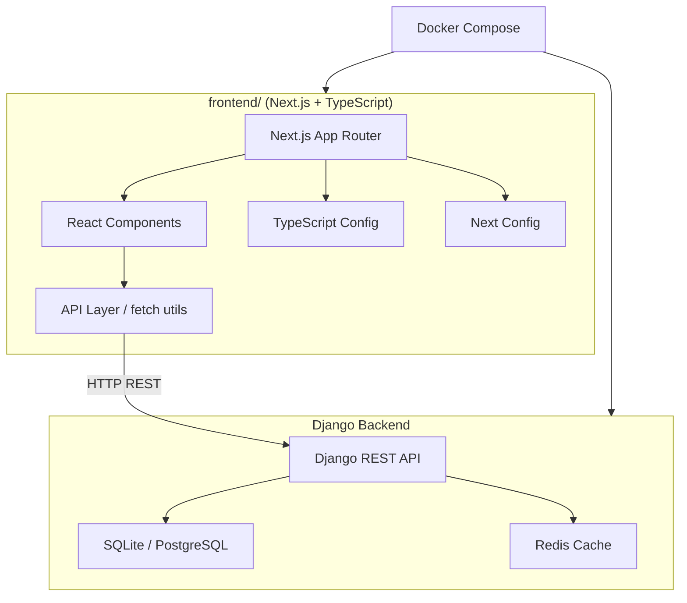
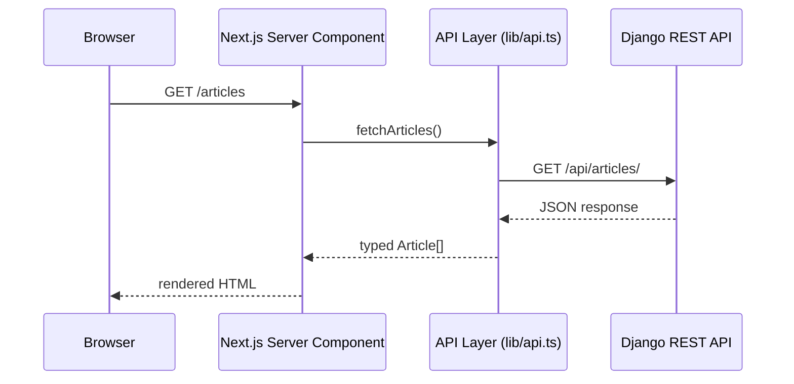
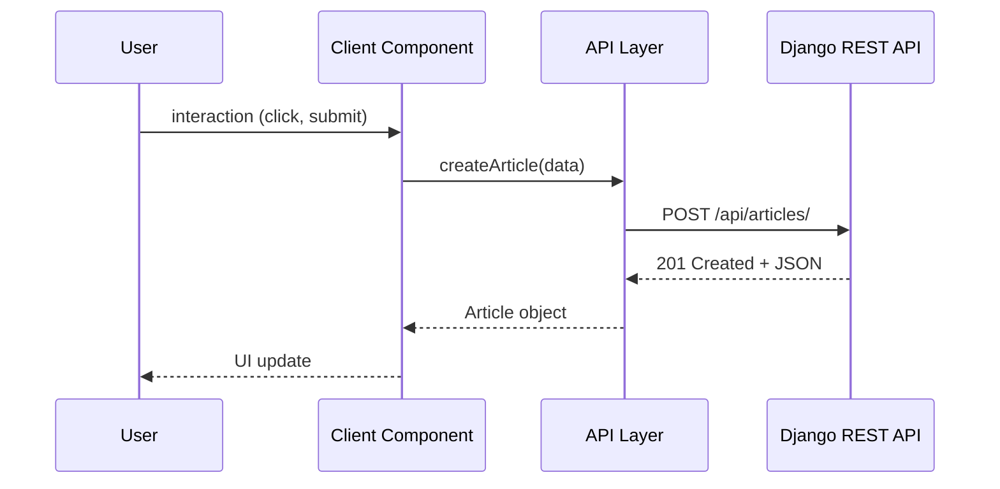

# Design Document: Next.js + TypeScript Setup

## Overview

Настройка отдельного фронтенд-приложения на Next.js 14 (App Router) с TypeScript поверх существующего Django-бэкенда. Фронтенд живёт в директории `frontend/` в корне проекта и общается с Django через REST API. Цель — получить production-ready структуру с правильной конфигурацией TypeScript, алиасами путей, переменными окружения и базовыми компонентами.

Проект использует Next.js App Router (не Pages Router), строгий режим TypeScript и абсолютные импорты через алиасы `@/`. Django продолжает работать независимо — фронтенд деплоится отдельно или через Docker Compose как отдельный сервис.

## Architecture



## Sequence Diagrams

### Запрос данных из Next.js в Django API



### Клиентский запрос (Client Component)



## Components and Interfaces

### Component 1: AppLayout (`app/layout.tsx`)

**Purpose**: Корневой layout — HTML-оболочка, глобальные стили, провайдеры.

**Interface**:
```typescript
interface RootLayoutProps {
  children: React.ReactNode
}

export default function RootLayout({ children }: RootLayoutProps): JSX.Element
```

**Responsibilities**:
- Устанавливает `<html lang>` и `<body>`
- Подключает глобальные CSS
- Оборачивает приложение в провайдеры (если нужны)

---

### Component 2: API Layer (`lib/api.ts`)

**Purpose**: Централизованный слой для HTTP-запросов к Django API.

**Interface**:
```typescript
interface ApiConfig {
  baseUrl: string
  defaultHeaders: Record<string, string>
}

interface FetchOptions extends RequestInit {
  params?: Record<string, string>
}

async function apiFetch<T>(endpoint: string, options?: FetchOptions): Promise<T>
```

**Responsibilities**:
- Формирует URL из `NEXT_PUBLIC_API_URL` + endpoint
- Добавляет заголовки (Content-Type, CSRF если нужен)
- Обрабатывает HTTP-ошибки единообразно
- Возвращает типизированный результат

---

### Component 3: Environment Config (`lib/config.ts`)

**Purpose**: Типобезопасный доступ к переменным окружения.

**Interface**:
```typescript
interface AppConfig {
  apiUrl: string
  isDevelopment: boolean
  isProduction: boolean
}

const config: AppConfig
```

**Responsibilities**:
- Валидирует обязательные env-переменные при старте
- Экспортирует единый объект конфигурации

---

### Component 4: Базовые UI-компоненты (`components/ui/`)

**Purpose**: Переиспользуемые примитивы интерфейса.

**Interface**:
```typescript
// Button
interface ButtonProps extends React.ButtonHTMLAttributes<HTMLButtonElement> {
  variant?: 'primary' | 'secondary' | 'danger'
  size?: 'sm' | 'md' | 'lg'
  isLoading?: boolean
}

// ErrorBoundary
interface ErrorBoundaryProps {
  children: React.ReactNode
  fallback?: React.ReactNode
}
```

## Data Models

### Model: Article (соответствует Django-модели)

```typescript
interface Article {
  id: number
  title: string
  content: string
  author: Author
  created_at: string   // ISO 8601
  updated_at: string
  tags: string[]
}

interface Author {
  id: number
  username: string
  avatar_url: string | null
}

// API response wrapper
interface PaginatedResponse<T> {
  count: number
  next: string | null
  previous: string | null
  results: T[]
}
```

**Validation Rules**:
- `title` — непустая строка, max 200 символов
- `content` — непустая строка
- `created_at` / `updated_at` — валидный ISO 8601

## Algorithmic Pseudocode

### Алгоритм: apiFetch — типизированный HTTP-клиент

```typescript
async function apiFetch<T>(endpoint: string, options?: FetchOptions): Promise<T> {
  // Precondition: endpoint starts with '/', NEXT_PUBLIC_API_URL is set
  const url = buildUrl(config.apiUrl, endpoint, options?.params)
  
  const response = await fetch(url, {
    ...options,
    headers: {
      'Content-Type': 'application/json',
      ...options?.headers,
    },
  })

  // Postcondition: throws ApiError on non-2xx, returns T on success
  if (!response.ok) {
    const error = await response.json().catch(() => ({}))
    throw new ApiError(response.status, error.detail ?? response.statusText)
  }

  return response.json() as Promise<T>
}
```

**Preconditions:**
- `endpoint` начинается с `/`
- `NEXT_PUBLIC_API_URL` задан в `.env.local`

**Postconditions:**
- При статусе 2xx возвращает `T`
- При статусе не-2xx бросает `ApiError` с кодом и сообщением
- Не мутирует входные параметры

**Loop Invariants:** N/A

---

### Алгоритм: validateEnv — проверка переменных окружения

```typescript
function validateEnv(): AppConfig {
  // Precondition: called once at module load time
  const apiUrl = process.env.NEXT_PUBLIC_API_URL
  
  if (!apiUrl) {
    throw new Error('NEXT_PUBLIC_API_URL is required')
  }

  // Postcondition: returns valid AppConfig or throws
  return {
    apiUrl,
    isDevelopment: process.env.NODE_ENV === 'development',
    isProduction: process.env.NODE_ENV === 'production',
  }
}
```

**Preconditions:**
- Вызывается на уровне модуля (не в runtime)

**Postconditions:**
- Возвращает `AppConfig` если все переменные заданы
- Бросает `Error` с понятным сообщением если переменная отсутствует

## Key Functions with Formal Specifications

### `apiFetch<T>(endpoint, options?)`

**Preconditions:**
- `endpoint` — непустая строка, начинается с `/`
- `config.apiUrl` — валидный URL

**Postconditions:**
- Возвращает `Promise<T>` при успехе
- Бросает `ApiError` при HTTP-ошибке
- Не имеет побочных эффектов кроме сетевого запроса

---

### `buildUrl(base, endpoint, params?)`

```typescript
function buildUrl(
  base: string,
  endpoint: string,
  params?: Record<string, string>
): string
```

**Preconditions:**
- `base` — валидный URL без trailing slash
- `endpoint` — начинается с `/`

**Postconditions:**
- Возвращает корректный URL
- Если `params` задан — добавляет query string
- `buildUrl('http://a.com', '/b', {x:'1'})` → `'http://a.com/b?x=1'`

## Example Usage

```typescript
// Server Component — получение списка статей
import { apiFetch } from '@/lib/api'
import type { PaginatedResponse, Article } from '@/types'

export default async function ArticlesPage() {
  const data = await apiFetch<PaginatedResponse<Article>>('/articles/')
  
  return (
    <ul>
      {data.results.map(article => (
        <li key={article.id}>{article.title}</li>
      ))}
    </ul>
  )
}

// Client Component — создание статьи
'use client'
import { useState } from 'react'
import { apiFetch } from '@/lib/api'
import type { Article } from '@/types'

export function CreateArticleForm() {
  const [title, setTitle] = useState('')

  async function handleSubmit(e: React.FormEvent) {
    e.preventDefault()
    const article = await apiFetch<Article>('/articles/', {
      method: 'POST',
      body: JSON.stringify({ title }),
    })
    console.log('Created:', article.id)
  }

  return (
    <form onSubmit={handleSubmit}>
      <input value={title} onChange={e => setTitle(e.target.value)} />
      <button type="submit">Create</button>
    </form>
  )
}
```

## Correctness Properties

*A property is a characteristic or behavior that should hold true across all valid executions of a system — essentially, a formal statement about what the system should do. Properties serve as the bridge between human-readable specifications and machine-verifiable correctness guarantees.*

### Property 1: 2xx response returns parsed value

*For any* mocked HTTP response with a 2xx status code and a valid JSON body, `apiFetch` should return the parsed JSON value and never throw.

**Validates: Requirements 3.2**

### Property 2: Non-2xx response throws ApiError

*For any* HTTP status code outside the 200–299 range, `apiFetch` should throw an `ApiError` whose `status` field equals that status code.

**Validates: Requirements 3.3, 8.2**

### Property 3: buildUrl always produces a valid URL

*For any* valid base URL string and endpoint string starting with `/`, `buildUrl` should return a string that is successfully parseable by the `URL` constructor without throwing.

**Validates: Requirements 4.3**

### Property 4: buildUrl with params includes all query parameters

*For any* record of string key-value pairs passed as `params`, the URL returned by `buildUrl` should contain every key and its corresponding value in the query string.

**Validates: Requirements 4.2**

### Property 5: buildUrl produces no double slashes

*For any* base URL without a trailing slash and endpoint starting with `/`, the URL returned by `buildUrl` should not contain `//` after the scheme separator.

**Validates: Requirements 4.4**

### Property 6: apiFetch does not mutate options

*For any* options object passed to `apiFetch`, the object's own enumerable properties should remain unchanged after the call completes (whether it resolves or rejects).

**Validates: Requirements 3.8**

### Property 7: apiFetch sets Content-Type header

*For any* request made via `apiFetch`, the outgoing request should include a `Content-Type: application/json` header regardless of whether the caller provided additional headers.

**Validates: Requirements 3.7**

### Property 8: validateEnv returns complete AppConfig for any valid API URL

*For any* non-empty string set as `NEXT_PUBLIC_API_URL`, `validateEnv()` should return an `AppConfig` object where `apiUrl` equals that string and both `isDevelopment` and `isProduction` are boolean values.

**Validates: Requirements 2.3**

### Property 9: RootLayout renders for any ReactNode children

*For any* value of type `React.ReactNode` (including `null`, `undefined`, strings, elements, and arrays), `RootLayout` should render without throwing an error.

**Validates: Requirements 5.2, 5.3**

### Property 10: CSRF header present on mutating requests

*For any* POST, PUT, or DELETE request made via `apiFetch`, the outgoing request should include an `X-CSRFToken` header with a non-empty value read from the CSRF cookie.

**Validates: Requirements 10.2**

## Error Handling

### Сценарий 1: Django API недоступен

**Condition**: `fetch()` бросает `TypeError: Failed to fetch`
**Response**: `apiFetch` пробрасывает ошибку наверх; Server Component показывает `error.tsx`
**Recovery**: Next.js `error.tsx` boundary отображает fallback UI с кнопкой retry

### Сценарий 2: Отсутствует env-переменная

**Condition**: `NEXT_PUBLIC_API_URL` не задан в `.env.local`
**Response**: `validateEnv()` бросает `Error` при старте модуля
**Recovery**: Приложение не запускается — разработчик видит явное сообщение в консоли

### Сценарий 3: API вернул 4xx/5xx

**Condition**: Django вернул ошибку (404, 422, 500)
**Response**: `apiFetch` бросает `ApiError` с кодом и сообщением из JSON
**Recovery**: Компонент ловит ошибку и показывает пользователю понятное сообщение

## Testing Strategy

### Unit Testing Approach

Тестировать `lib/api.ts` и `lib/config.ts` с помощью Jest + `jest-fetch-mock`. Покрыть: успешный запрос, HTTP-ошибки, формирование URL с параметрами.

### Property-Based Testing Approach

**Property Test Library**: fast-check

Свойства для тестирования:
- `buildUrl(base, endpoint, params)` всегда возвращает валидный URL для любых корректных входных данных
- `apiFetch` никогда не возвращает `undefined` при успешном ответе

### Integration Testing Approach

Playwright или Cypress для E2E: проверить что страницы рендерятся с данными из Django API (с моком или реальным бэкендом в Docker Compose).

## Performance Considerations

- Server Components используются по умолчанию — данные фетчатся на сервере, клиент получает готовый HTML
- `next/image` для оптимизации изображений
- Route-level code splitting из коробки в App Router
- Кэширование fetch-запросов через `{ next: { revalidate: 60 } }` для статичных данных

## Security Considerations

- `NEXT_PUBLIC_*` переменные попадают в клиентский бандл — не хранить секреты с этим префиксом
- CSRF: Django использует CSRF-токены для POST/PUT/DELETE — нужно передавать `X-CSRFToken` заголовок из cookie
- CORS: Django должен разрешить запросы с домена фронтенда через `django-cors-headers`
- Валидация входных данных на уровне TypeScript-типов + Zod (опционально) перед отправкой в API

## Dependencies

| Пакет | Версия | Назначение |
|-------|--------|-----------|
| `next` | 14.x | Фреймворк |
| `react` | 18.x | UI |
| `react-dom` | 18.x | DOM-рендеринг |
| `typescript` | 5.x | Типизация |
| `@types/react` | 18.x | Типы React |
| `@types/node` | 20.x | Типы Node.js |
| `eslint` | 8.x | Линтер |
| `eslint-config-next` | 14.x | ESLint-правила для Next.js |
