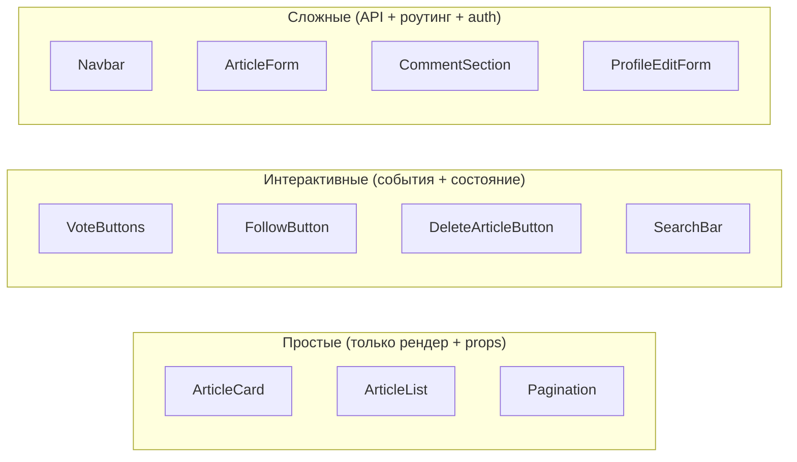

# Design Document: React Testing с Jest для Next.js 14

## Overview

Настройка полноценной тестовой инфраструктуры для Next.js 14 / React 18 / TypeScript проекта на базе Jest + React Testing Library. Цель — покрыть все 11 компонентов в `frontend/src/components/` юнит-тестами, обеспечить надёжные хелперы для моков и создать воспроизводимую стратегию тестирования.

Проект использует `'use client'`-компоненты с хуками Next.js (`useRouter`, `usePathname`, `useSearchParams`), вызовами API и локальным состоянием — всё это требует специфических стратегий мокирования.

---

## Architecture

### Структура тестовой инфраструктуры

```mermaid
graph TD
    A[Jest + ts-jest] --> B[jest.config.ts]
    B --> C[jest.setup.ts]
    C --> D[@testing-library/react]
    C --> E[@testing-library/jest-dom]
    C --> F[Моки Next.js]

    G[__tests__/] --> H[components/]
    G --> I[helpers/]

    H --> H1[ArticleCard.test.tsx]
    H --> H2[ArticleList.test.tsx]
    H --> H3[Pagination.test.tsx]
    H --> H4[Navbar.test.tsx]
    H --> H5[VoteButtons.test.tsx]
    H --> H6[FollowButton.test.tsx]
    H --> H7[DeleteArticleButton.test.tsx]
    H --> H8[ArticleForm.test.tsx]
    H --> H9[SearchBar.test.tsx]
    H --> H10[CommentSection.test.tsx]
    H --> H11[ProfileEditForm.test.tsx]

    I --> I1[render.tsx — кастомный render]
    I --> I2[factories.ts — фабрики данных]
    I --> I3[mocks.ts — моки API/auth]
```

### Категории компонентов по сложности тестирования



---

## Components and Interfaces

### Тестовая инфраструктура

#### Кастомный render-хелпер

**Назначение**: Оборачивает компоненты в необходимые провайдеры (Toaster и т.д.) и предоставляет единую точку рендера для всех тестов.

**Интерфейс**:
```typescript
interface RenderOptions extends RTLRenderOptions {
  // расширяемые опции для будущих провайдеров
}

function renderWithProviders(
  ui: React.ReactElement,
  options?: RenderOptions
): RenderResult
```

#### Фабрики тестовых данных

**Назначение**: Создают типизированные объекты-заглушки, соответствующие типам из `lib/types.ts`.

**Интерфейс**:
```typescript
function makeUser(overrides?: Partial<User>): User
function makeTag(overrides?: Partial<Tag>): Tag
function makeArticle(overrides?: Partial<ArticleList>): ArticleList
function makeArticleDetail(overrides?: Partial<ArticleDetail>): ArticleDetail
function makeComment(overrides?: Partial<Comment>): Comment
function makeProfile(overrides?: Partial<Profile>): Profile
```

#### Моки модулей

**Назначение**: Централизованные `jest.mock()` для `lib/api`, `lib/auth`, `next/navigation`.

**Интерфейс**:
```typescript
// Мок next/navigation
const mockPush = jest.fn()
const mockPathname = '/test-path'

// Мок lib/auth
function mockAuthenticatedUser(user?: User): void
function mockUnauthenticatedUser(): void

// Мок lib/api
function mockApiSuccess<T>(fn: jest.Mock, data: T): void
function mockApiError(fn: jest.Mock, status: number, message: string): void
```

---

## Data Models

### Тестовые фикстуры (соответствуют `lib/types.ts`)

```typescript
// Базовые фикстуры
const TEST_USER: User = { id: 1, username: 'testuser' }

const TEST_TAG: Tag = { id: 1, name: 'python', slug: 'python' }

const TEST_ARTICLE: ArticleList = {
  id: 1,
  slug: 'test-article',
  title: 'Test Article',
  author: TEST_USER,
  tags: [TEST_TAG],
  status: 'published',
  views: 42,
  rating: 5,
  created_at: '2024-01-15T10:00:00Z',
}

const TEST_ARTICLE_DETAIL: ArticleDetail = {
  ...TEST_ARTICLE,
  content: 'Article content here',
  comments: [],
  updated_at: '2024-01-15T12:00:00Z',
}
```

---

## Key Functions with Formal Specifications

### `parseTags()` (внутри ArticleForm)

```typescript
function parseTags(raw: string): string[]
```

**Preconditions:**
- `raw` — строка (может быть пустой)

**Postconditions:**
- Возвращает массив строк без пробелов по краям
- Пустые строки отфильтрованы
- `parseTags('')` → `[]`
- `parseTags('a, b, c')` → `['a', 'b', 'c']`

### `buildPageUrl()` (внутри Pagination)

```typescript
function buildPageUrl(n: number, searchParams?: Record<string, string>): string
```

**Preconditions:**
- `n` — положительное целое число

**Postconditions:**
- Возвращает строку вида `?page=N[&key=value...]`
- Существующие `searchParams` сохраняются
- Параметр `page` всегда перезаписывается значением `n`

### `handleVote()` (VoteButtons)

```typescript
async function handleVote(value: 1 | -1): Promise<void>
```

**Preconditions:**
- `value` ∈ `{1, -1}`

**Postconditions:**
- Если пользователь не авторизован → редирект на `/login`
- Если API успешен → `rating` обновляется до `result.rating`
- Если API вернул 403 → `rating` откатывается к предыдущему значению
- Оптимистичное обновление: `rating` меняется до ответа API

---

## Algorithmic Pseudocode

### Алгоритм тестирования интерактивного компонента

```pascal
PROCEDURE testInteractiveComponent(component, mockSetup, action, assertion)
  INPUT: component — React-компонент
         mockSetup — функция настройки моков
         action — пользовательское действие
         assertion — проверяемое условие
  OUTPUT: результат теста (pass/fail)

  BEGIN
    // 1. Подготовка
    mockSetup()
    render(component)

    // 2. Действие
    element ← screen.getByRole(action.role, { name: action.label })
    await userEvent.click(element)

    // 3. Проверка
    IF action.isAsync THEN
      await waitFor(() => assertion())
    ELSE
      assertion()
    END IF
  END
END PROCEDURE
```

### Алгоритм тестирования с API-моком

```pascal
PROCEDURE testWithApiMock(component, apiMock, expectedBehavior)
  BEGIN
    // Arrange
    apiMock.mockResolvedValue(expectedBehavior.successData)
    render(component)

    // Act
    trigger(expectedBehavior.userAction)

    // Assert — успешный путь
    await waitFor(() =>
      ASSERT expectedBehavior.successAssertion IS true
    )

    // Assert — путь ошибки
    apiMock.mockRejectedValue(new ApiError(expectedBehavior.errorStatus))
    trigger(expectedBehavior.userAction)

    await waitFor(() =>
      ASSERT expectedBehavior.errorAssertion IS true
    )
  END
END PROCEDURE
```

---

## Example Usage

### Конфигурация Jest

```typescript
// jest.config.ts
import type { Config } from 'jest'
import nextJest from 'next/jest.js'

const createJestConfig = nextJest({ dir: './frontend' })

const config: Config = {
  testEnvironment: 'jsdom',
  setupFilesAfterFramework: ['<rootDir>/jest.setup.ts'],
  moduleNameMapper: {
    '^@/(.*)$': '<rootDir>/frontend/src/$1',
  },
  testMatch: ['**/__tests__/**/*.test.{ts,tsx}'],
  collectCoverageFrom: ['frontend/src/components/**/*.{ts,tsx}'],
}

export default createJestConfig(config)
```

### jest.setup.ts

```typescript
import '@testing-library/jest-dom'

// Мок next/navigation
jest.mock('next/navigation', () => ({
  useRouter: () => ({ push: jest.fn(), replace: jest.fn() }),
  usePathname: () => '/',
  useSearchParams: () => new URLSearchParams(),
}))
```

### Тест ArticleCard (простой компонент)

```typescript
import { render, screen } from '@testing-library/react'
import ArticleCard from '@/components/ArticleCard'
import { makeArticle } from '../helpers/factories'

describe('ArticleCard', () => {
  it('отображает заголовок со ссылкой на статью', () => {
    const article = makeArticle({ title: 'My Article', slug: 'my-article' })
    render(<ArticleCard article={article} />)

    const link = screen.getByRole('link', { name: 'My Article' })
    expect(link).toHaveAttribute('href', '/articles/my-article')
  })

  it('отображает теги', () => {
    const article = makeArticle({ tags: [makeTag({ name: 'python' })] })
    render(<ArticleCard article={article} />)

    expect(screen.getByText('python')).toBeInTheDocument()
  })

  it('отображает рейтинг и просмотры', () => {
    const article = makeArticle({ rating: 10, views: 100 })
    render(<ArticleCard article={article} />)

    expect(screen.getByText(/10/)).toBeInTheDocument()
    expect(screen.getByText(/100/)).toBeInTheDocument()
  })
})
```

### Тест VoteButtons (интерактивный с API)

```typescript
import { render, screen, waitFor } from '@testing-library/react'
import userEvent from '@testing-library/user-event'
import VoteButtons from '@/components/VoteButtons'
import { voteArticle } from '@/lib/api'
import { getToken } from '@/lib/auth'

jest.mock('@/lib/api')
jest.mock('@/lib/auth')

const mockVoteArticle = voteArticle as jest.Mock
const mockGetToken = getToken as jest.Mock

describe('VoteButtons', () => {
  beforeEach(() => {
    mockGetToken.mockReturnValue('token-123')
  })

  it('оптимистично обновляет рейтинг при лайке', async () => {
    mockVoteArticle.mockResolvedValue({ rating: 6 })
    render(<VoteButtons slug="test" initialRating={5} />)

    await userEvent.click(screen.getByRole('button', { name: 'Лайк' }))

    // Оптимистичное обновление
    expect(screen.getByText('6')).toBeInTheDocument()

    await waitFor(() => expect(mockVoteArticle).toHaveBeenCalledWith('test', 1))
  })

  it('откатывает рейтинг при ошибке 403', async () => {
    mockVoteArticle.mockRejectedValue({ status: 403 })
    render(<VoteButtons slug="test" initialRating={5} />)

    await userEvent.click(screen.getByRole('button', { name: 'Лайк' }))

    await waitFor(() => expect(screen.getByText('5')).toBeInTheDocument())
  })

  it('редиректит на /login если не авторизован', async () => {
    mockGetToken.mockReturnValue(null)
    const mockPush = jest.fn()
    jest.mocked(require('next/navigation').useRouter).mockReturnValue({ push: mockPush })

    render(<VoteButtons slug="test" initialRating={5} />)
    await userEvent.click(screen.getByRole('button', { name: 'Лайк' }))

    expect(mockPush).toHaveBeenCalledWith('/login')
  })
})
```

### Тест Pagination (чистая логика)

```typescript
import { render, screen } from '@testing-library/react'
import Pagination from '@/components/Pagination'

describe('Pagination', () => {
  it('не рендерится при одной странице', () => {
    const { container } = render(<Pagination count={5} page={1} pageSize={10} />)
    expect(container).toBeEmptyDOMElement()
  })

  it('отключает кнопку "Назад" на первой странице', () => {
    render(<Pagination count={30} page={1} pageSize={10} />)
    expect(screen.getByText('Назад').closest('li')).toHaveClass('disabled')
  })

  it('генерирует корректные URL с сохранением searchParams', () => {
    render(<Pagination count={30} page={2} pageSize={10} searchParams={{ search: 'test' }} />)
    const links = screen.getAllByRole('link')
    expect(links[0]).toHaveAttribute('href', '?search=test&page=1')
  })
})
```

### Фабрики тестовых данных

```typescript
// frontend/__tests__/helpers/factories.ts
import type { User, Tag, ArticleList, ArticleDetail, Comment } from '@/lib/types'

let idCounter = 0
const nextId = () => ++idCounter

export const makeUser = (overrides?: Partial<User>): User => ({
  id: nextId(),
  username: `user-${nextId()}`,
  ...overrides,
})

export const makeTag = (overrides?: Partial<Tag>): Tag => ({
  id: nextId(),
  name: 'tag',
  slug: 'tag',
  ...overrides,
})

export const makeArticle = (overrides?: Partial<ArticleList>): ArticleList => ({
  id: nextId(),
  slug: `article-${nextId()}`,
  title: 'Test Article',
  author: makeUser(),
  tags: [],
  status: 'published',
  views: 0,
  rating: 0,
  created_at: '2024-01-01T00:00:00Z',
  ...overrides,
})
```

---

## Error Handling

### Сценарий 1: API возвращает ошибку

**Условие**: `voteArticle`, `followUser`, `deleteArticle` бросают `ApiError`
**Ответ**: Компонент откатывает оптимистичное обновление или показывает сообщение об ошибке
**Тест**: Мокировать `mockRejectedValue`, проверить что UI вернулся в исходное состояние

### Сценарий 2: Пользователь не авторизован

**Условие**: `getToken()` возвращает `null`
**Ответ**: `VoteButtons` редиректит на `/login`; `FollowButton` отключён (`disabled`)
**Тест**: `mockGetToken.mockReturnValue(null)`, проверить `disabled` атрибут или вызов `router.push`

### Сценарий 3: Валидационные ошибки формы

**Условие**: API возвращает `400` с JSON полей ошибок
**Ответ**: `ArticleForm` показывает `invalid-feedback` под каждым полем
**Тест**: Мокировать `ApiError` со статусом 400 и JSON-телом, проверить наличие `.is-invalid` классов

---

## Testing Strategy

### Юнит-тестирование

Каждый компонент тестируется изолированно. Все внешние зависимости (`lib/api`, `lib/auth`, `next/navigation`) мокируются через `jest.mock()`.

Приоритет покрытия:
1. **Критические** (бизнес-логика): `VoteButtons`, `ArticleForm`, `FollowButton`, `DeleteArticleButton`
2. **Средние** (рендер + условная логика): `Navbar`, `ArticleList`, `Pagination`, `SearchBar`
3. **Простые** (только рендер): `ArticleCard`, `CommentSection`, `ProfileEditForm`

### Стратегия мокирования Next.js

```typescript
// Глобальный мок в jest.setup.ts
jest.mock('next/navigation', () => ({
  useRouter: jest.fn(() => ({ push: jest.fn(), replace: jest.fn(), back: jest.fn() })),
  usePathname: jest.fn(() => '/'),
  useSearchParams: jest.fn(() => new URLSearchParams()),
}))

// Переопределение в конкретном тесте
import { useRouter } from 'next/navigation'
jest.mocked(useRouter).mockReturnValue({ push: mockPush } as any)
```

### Подход к тестированию `'use client'` компонентов

- Все клиентские компоненты тестируются в `jsdom` окружении
- `next/image` и `next/link` работают нативно через `next/jest` трансформер
- `window.confirm` мокируется через `jest.spyOn(window, 'confirm')`

### Property-Based Testing

Для чистых функций (`parseTags`, `buildPageUrl`) можно применить `fast-check`:

```typescript
import fc from 'fast-check'

test('parseTags всегда возвращает массив без пустых строк', () => {
  fc.assert(
    fc.property(fc.string(), (raw) => {
      const result = parseTags(raw)
      expect(result.every(t => t.length > 0)).toBe(true)
    })
  )
})
```

**Property Test Library**: fast-check

### Покрытие

Цель: ≥ 80% statement coverage для `frontend/src/components/`.

```bash
# Запуск тестов с покрытием
npx jest --coverage --testPathPattern="__tests__/components"
```

---

## Performance Considerations

- Использовать `jest.clearAllMocks()` в `beforeEach` для изоляции тестов
- Избегать `waitFor` с длинными таймаутами — предпочитать `findBy*` запросы
- Группировать связанные тесты в `describe` блоки для параллельного запуска

---

## Security Considerations

- Не хранить реальные токены в тестовых фикстурах — использовать `'test-token-123'`
- Мокировать `localStorage`/`sessionStorage` через `jest-localstorage-mock` или встроенный `jsdom`
- Не делать реальных HTTP-запросов в тестах — все API-вызовы должны быть замоканы

---

## Dependencies

### Новые devDependencies (устанавливаются в `frontend/`)

```json
{
  "jest": "^29",
  "jest-environment-jsdom": "^29",
  "ts-jest": "^29",
  "@types/jest": "^29",
  "@testing-library/react": "^16",
  "@testing-library/jest-dom": "^6",
  "@testing-library/user-event": "^14",
  "fast-check": "^3"
}
```

### Команда установки

```bash
cd frontend && npm install --save-dev \
  jest jest-environment-jsdom ts-jest @types/jest \
  @testing-library/react @testing-library/jest-dom \
  @testing-library/user-event fast-check
```

### Новый скрипт в `package.json`

```json
{
  "scripts": {
    "test": "jest",
    "test:coverage": "jest --coverage"
  }
}
```


---

## Correctness Properties

*A property is a characteristic or behavior that should hold true across all valid executions of a system — essentially, a formal statement about what the system should do. Properties serve as the bridge between human-readable specifications and machine-verifiable correctness guarantees.*

### Property 1: Factory overrides are always applied

*For any* factory function (`makeUser`, `makeTag`, `makeArticle`, `makeArticleDetail`, `makeComment`, `makeProfile`) and any valid partial override object, calling the factory with those overrides must produce an object where every overridden field equals the provided value.

**Validates: Requirements 4.8**

### Property 2: Factory IDs are always unique

*For any* sequence of factory calls (regardless of factory type or order), all generated `id` values across the entire sequence must be distinct.

**Validates: Requirements 4.9**

### Property 3: Optimistic vote update reflects API response

*For any* initial rating value and any successful API response from `voteArticle`, after the vote resolves the displayed rating must equal the `rating` field returned by the API — not the locally computed value.

**Validates: Requirements 7.4**

### Property 4: Vote rollback on 403 error

*For any* initial rating value, when `voteArticle` rejects with a 403 error, the displayed rating must revert to the original initial value — regardless of any optimistic update that was applied before the response.

**Validates: Requirements 7.5**

### Property 5: `parseTags` never returns empty strings

*For any* string input (including empty string, whitespace-only strings, strings with consecutive commas, and arbitrary Unicode), `parseTags` must return an array where every element has length > 0.

**Validates: Requirements 9.5**

### Property 6: `parseTags` / `formatTags` round-trip

*For any* valid tag array (array of non-empty strings without leading/trailing whitespace), parsing the result of formatting that array must produce an array equivalent to the original.

**Validates: Requirements 9.7**

### Property 7: `buildPageUrl` always encodes the requested page number

*For any* positive integer `n` and any `searchParams` record (including empty, single-entry, and multi-entry maps), the URL returned by `buildPageUrl(n, searchParams)` must contain the query parameter `page=n`.

**Validates: Requirements 10.5**

### Property 8: `buildPageUrl` preserves existing search parameters

*For any* positive integer `n` and any `searchParams` record, every key-value pair from `searchParams` (except `page`) must appear in the returned URL unchanged.

**Validates: Requirements 6.12, 10.3**
