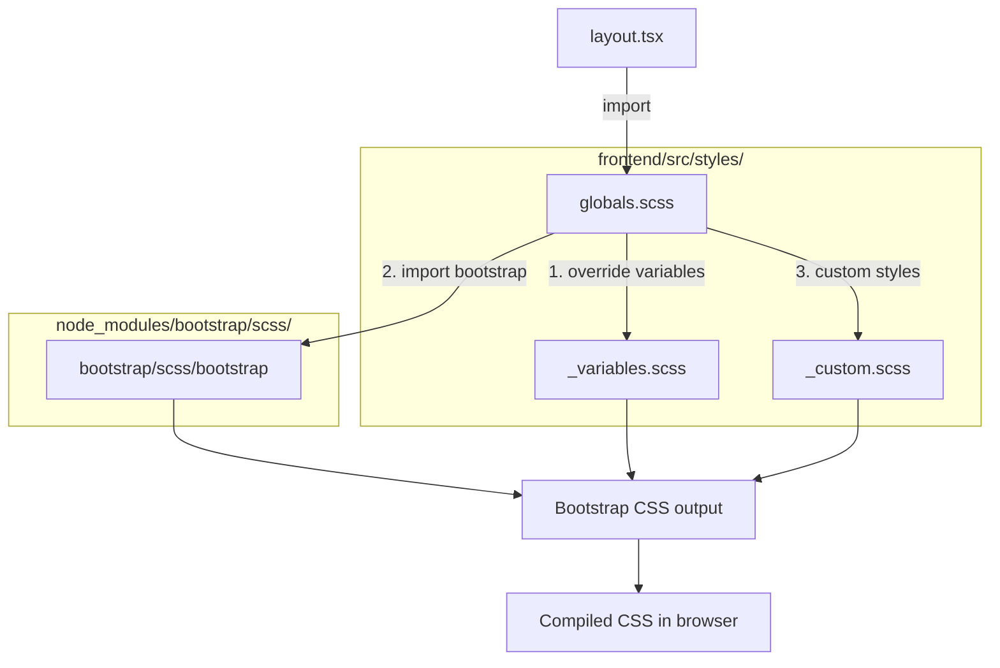
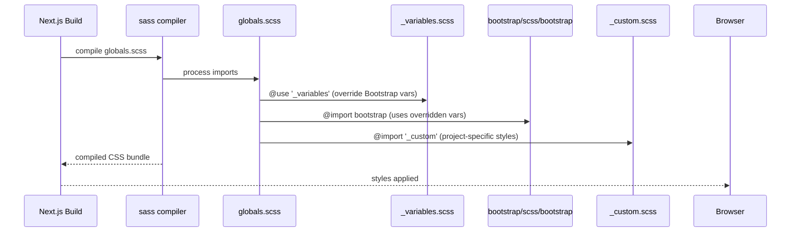
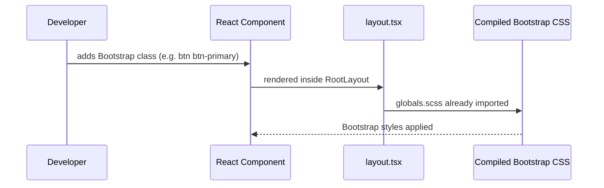

# Design Document: SCSS + Bootstrap Setup

## Overview

Добавление Bootstrap 5 и SCSS в существующий Next.js 14 (App Router) + TypeScript проект в директории `frontend/`. Bootstrap подключается через SCSS-импорты, что позволяет переопределять переменные до загрузки фреймворка и получать только нужные части Bootstrap. Next.js поддерживает SCSS из коробки при наличии пакета `sass`.

Текущий `globals.css` заменяется на `globals.scss`. Кастомизация Bootstrap происходит через переопределение SCSS-переменных перед импортом Bootstrap — стандартный подход, рекомендованный документацией Bootstrap 5.

## Architecture



## Sequence Diagrams

### Порядок компиляции SCSS



### Использование Bootstrap в компоненте



## Components and Interfaces

### Component 1: `globals.scss` (точка входа стилей)

**Purpose**: Главный SCSS-файл, заменяет `globals.css`. Оркестрирует порядок импортов.

**Interface**:
```scss
// Порядок импортов критичен:
// 1. Переопределение переменных Bootstrap
// 2. Импорт Bootstrap
// 3. Кастомные стили проекта
```

**Responsibilities**:
- Импортирует `_variables.scss` с переопределёнными переменными Bootstrap
- Импортирует Bootstrap SCSS
- Импортирует `_custom.scss` для проектных стилей
- Содержит базовые reset-стили (перенесённые из `globals.css`)

---

### Component 2: `_variables.scss` (кастомизация Bootstrap)

**Purpose**: Переопределение Bootstrap SCSS-переменных до загрузки фреймворка.

**Interface**:
```scss
// Переменные Bootstrap переопределяются через !default механизм
// Bootstrap читает переменную только если она ещё не задана
$primary: #your-color;
$font-family-base: 'Your Font', sans-serif;
```

**Responsibilities**:
- Хранит все кастомные значения Bootstrap-переменных
- Не импортирует Bootstrap напрямую (только переменные)
- Является единственным местом для изменения Bootstrap-темы

---

### Component 3: `_custom.scss` (проектные стили)

**Purpose**: Кастомные стили поверх Bootstrap, специфичные для проекта.

**Interface**:
```scss
// Стили компонентов, утилиты, переопределения Bootstrap-классов
.my-component { ... }
```

**Responsibilities**:
- Содержит стили, не покрытые Bootstrap
- Может использовать Bootstrap SCSS-переменные и миксины (они уже загружены)
- Импортируется последним — имеет наивысший приоритет

---

### Component 4: `layout.tsx` (обновлённый)

**Purpose**: Корневой layout с импортом `globals.scss` вместо `globals.css`.

**Interface**:
```typescript
import '../styles/globals.scss'  // единственное изменение
```

**Responsibilities**:
- Импортирует `globals.scss` как единственную точку входа стилей
- Остальная логика layout не меняется

## Data Models

### Структура файлов стилей

```
frontend/src/
├── app/
│   ├── layout.tsx          # импортирует globals.scss
│   ├── page.tsx
│   └── globals.css         # удаляется (заменяется на globals.scss)
└── styles/
    ├── globals.scss         # точка входа (NEW)
    ├── _variables.scss      # Bootstrap переменные (NEW)
    └── _custom.scss         # проектные стили (NEW)
```

### Bootstrap переменные для кастомизации

```scss
// Цвета (полный список: node_modules/bootstrap/scss/_variables.scss)
$primary:   #0d6efd;   // Bootstrap default, переопределить при необходимости
$secondary: #6c757d;
$success:   #198754;
$danger:    #dc3545;
$warning:   #ffc107;
$info:      #0dcaf0;

// Типографика
$font-family-base: system-ui, -apple-system, sans-serif;
$font-size-base:   1rem;
$line-height-base: 1.5;

// Сетка
$grid-columns:      12;
$grid-gutter-width: 1.5rem;

// Breakpoints
$grid-breakpoints: (
  xs: 0,
  sm: 576px,
  md: 768px,
  lg: 992px,
  xl: 1200px,
  xxl: 1400px
);
```

## Algorithmic Pseudocode

### Алгоритм: порядок SCSS-импортов в globals.scss

```pascal
ALGORITHM compileGlobalStyles
INPUT: globals.scss entry point
OUTPUT: compiled CSS with Bootstrap + customizations

BEGIN
  // Step 1: Load variable overrides BEFORE Bootstrap
  // Bootstrap uses !default — variables set before import take precedence
  IMPORT _variables.scss
  
  // Step 2: Import full Bootstrap
  // Bootstrap reads $primary, $font-family-base, etc. from Step 1
  IMPORT bootstrap/scss/bootstrap
  
  // Step 3: Project-specific styles (can use Bootstrap vars/mixins)
  IMPORT _custom.scss
  
  // Step 4: Base resets (carried over from globals.css)
  APPLY box-sizing: border-box to all elements
  APPLY overflow-x: hidden to html, body
END
```

**Preconditions:**
- `bootstrap` пакет установлен в `node_modules`
- `sass` пакет установлен (Next.js требует его для компиляции SCSS)
- `_variables.scss` импортируется строго до Bootstrap

**Postconditions:**
- Все Bootstrap-классы доступны глобально
- Кастомные переменные применены к Bootstrap-компонентам
- Нет конфликтов с существующими стилями

**Loop Invariants:** N/A

---

### Алгоритм: переопределение Bootstrap переменной

```pascal
ALGORITHM overrideBootstrapVariable
INPUT: variable name, custom value
OUTPUT: Bootstrap compiled with custom value

BEGIN
  // Bootstrap pattern: variables defined with !default
  // !default means "use this value ONLY if variable is not already set"
  
  // In _variables.scss (loaded FIRST):
  SET $primary = #custom-color   // no !default — always wins
  
  // In bootstrap/_variables.scss (loaded SECOND):
  SET $primary = #0d6efd !default  // ignored because $primary already set
  
  // Result: Bootstrap uses #custom-color for all $primary references
  RETURN compiled CSS with custom color
END
```

## Key Functions with Formal Specifications

### `globals.scss` — точка входа

**Preconditions:**
- `sass` установлен как dev-dependency
- `bootstrap` установлен как dependency
- `_variables.scss` существует в той же директории

**Postconditions:**
- Все Bootstrap CSS-классы доступны в приложении
- Кастомные переменные из `_variables.scss` применены
- Базовые reset-стили активны

---

### `_variables.scss` — переопределение переменных

**Preconditions:**
- Импортируется до `bootstrap/scss/bootstrap`
- Содержит только переменные (без `@import bootstrap`)

**Postconditions:**
- Переменные без `!default` переопределяют Bootstrap-дефолты
- Bootstrap компилируется с кастомными значениями

---

### `layout.tsx` — обновлённый импорт

**Preconditions:**
- `globals.scss` существует по пути `../styles/globals.scss` относительно `layout.tsx`
- Старый импорт `./globals.css` удалён

**Postconditions:**
- Стили применяются ко всему приложению через корневой layout
- TypeScript не выдаёт ошибок (Next.js поддерживает импорт `.scss`)

## Example Usage

### Установка зависимостей

```bash
cd frontend
npm install bootstrap@5 sass
```

### globals.scss

```scss
// 1. Переопределяем Bootstrap переменные
@import 'variables';

// 2. Импортируем Bootstrap
@import 'bootstrap/scss/bootstrap';

// 3. Проектные стили
@import 'custom';

// 4. Базовые reset-стили (из globals.css)
*,
*::before,
*::after {
  box-sizing: border-box;
}

html,
body {
  max-width: 100vw;
  overflow-x: hidden;
}
```

### _variables.scss

```scss
// Кастомизация Bootstrap 5
// Полный список переменных: node_modules/bootstrap/scss/_variables.scss

// Цвета бренда
$primary:   #0d6efd;
$secondary: #6c757d;

// Типографика
$font-family-base: system-ui, -apple-system, 'Segoe UI', Roboto, sans-serif;

// Скруглённые углы
$border-radius: 0.375rem;
```

### _custom.scss

```scss
// Проектные стили поверх Bootstrap
// Здесь доступны все Bootstrap переменные и миксины

.page-wrapper {
  min-height: 100vh;
  display: flex;
  flex-direction: column;
}
```

### layout.tsx (обновлённый)

```typescript
import type { Metadata } from 'next'
import '../styles/globals.scss'  // заменяем ./globals.css

export const metadata: Metadata = {
  title: 'Frontend',
  description: 'Next.js frontend',
}

export default function RootLayout({
  children,
}: {
  children: React.ReactNode
}) {
  return (
    <html lang="ru">
      <body>{children}</body>
    </html>
  )
}
```

### Использование Bootstrap классов в компоненте

```typescript
// frontend/src/app/page.tsx
export default function Home() {
  return (
    <main className="container py-5">
      <div className="row">
        <div className="col-12">
          <h1 className="display-4 mb-4">Hello from Next.js</h1>
          <button className="btn btn-primary">Bootstrap Button</button>
        </div>
      </div>
    </main>
  )
}
```

## Correctness Properties

*A property is a characteristic or behavior that should hold true across all valid executions of a system — essentially, a formal statement about what the system should do. Properties serve as the bridge between human-readable specifications and machine-verifiable correctness guarantees.*

### Property 1: Bootstrap классы доступны после импорта globals.scss

*Для любого* Bootstrap CSS-класса (например `btn`, `container`, `row`), после импорта `globals.scss` в `layout.tsx`, этот класс должен применяться к элементам во всём приложении.

**Validates: Requirements 6.4**

### Property 2: Переопределение переменной влияет на все Bootstrap-компоненты

*Для любой* Bootstrap SCSS-переменной, переопределённой в `_variables.scss` без `!default`, скомпилированный CSS должен использовать кастомное значение во всех местах, где Bootstrap ссылается на эту переменную.

**Validates: Requirements 4.1**

### Property 3: Порядок импортов детерминирован

*Всегда* `_variables.scss` компилируется до `bootstrap/scss/bootstrap`, а `_custom.scss` — после. Изменение порядка должно приводить к предсказуемому изменению результата (переменные не применяются / кастомные стили перекрываются Bootstrap).

**Validates: Requirements 3.1, 3.2, 3.3, 3.5**

### Property 4: Стили из _custom.scss имеют приоритет над Bootstrap

*При любом* наборе CSS-правил с одинаковой специфичностью, определённых и в Bootstrap, и в `_custom.scss`, стили из `_custom.scss` (загруженные последними) должны иметь приоритет в каскаде.

**Validates: Requirements 5.1, 5.3**

### Property 5: Next.js компилирует SCSS без ошибок при наличии sass

*Для любого* валидного SCSS-файла, импортированного в Next.js при установленном пакете `sass`, `next build` должен завершаться без ошибок компиляции стилей.

**Validates: Requirements 1.3, 7.1**

## Error Handling

### Сценарий 1: `sass` не установлен

**Condition**: `globals.scss` импортируется, но `sass` отсутствует в `node_modules`
**Response**: Next.js выдаёт ошибку при старте: `"To use Next.js' built-in Sass support, you first need to install sass"`
**Recovery**: Выполнить `npm install sass` в директории `frontend/`

### Сценарий 2: Неверный порядок импортов в globals.scss

**Condition**: Bootstrap импортируется до `_variables.scss`
**Response**: Кастомные переменные игнорируются — Bootstrap компилируется с дефолтными значениями
**Recovery**: Переставить импорты: `_variables` → `bootstrap` → `_custom`

### Сценарий 3: Импорт несуществующего SCSS-файла

**Condition**: `@import 'variables'` но файл `_variables.scss` не создан
**Response**: Ошибка компиляции Sass: `"Can't find stylesheet to import"`
**Recovery**: Создать файл `_variables.scss` в директории `frontend/src/styles/`

### Сценарий 4: Конфликт путей импорта

**Condition**: `layout.tsx` импортирует `./globals.css` (старый путь) вместо `../styles/globals.scss`
**Response**: CSS-файл загружается без Bootstrap; SCSS-файл не компилируется
**Recovery**: Обновить импорт в `layout.tsx` на `'../styles/globals.scss'`

## Testing Strategy

### Unit Testing Approach

Проверить что `layout.tsx` корректно импортирует `globals.scss` и рендерит children. Тест компонентов с Bootstrap-классами через React Testing Library — проверить наличие классов в DOM.

### Property-Based Testing Approach

**Property Test Library**: fast-check

Свойства для тестирования:
- Для любого набора Bootstrap-классов, переданных в `className`, компонент рендерится без ошибок
- Для любого валидного SCSS-контента в `_custom.scss`, сборка завершается успешно

### Integration Testing Approach

Playwright: проверить что Bootstrap-стили применяются визуально — кнопка с классом `btn btn-primary` имеет ожидаемый цвет фона (соответствующий `$primary` из `_variables.scss`).

## Performance Considerations

- Bootstrap 5 SCSS весит ~200KB до компиляции; после минификации в production — ~30KB (gzip)
- Для оптимизации можно импортировать только нужные части Bootstrap вместо полного `bootstrap/scss/bootstrap`:
  ```scss
  @import 'bootstrap/scss/functions';
  @import 'bootstrap/scss/variables';
  @import 'bootstrap/scss/mixins';
  @import 'bootstrap/scss/grid';
  @import 'bootstrap/scss/utilities';
  // ... только нужные модули
  ```
- Next.js автоматически минифицирует CSS в production-сборке
- CSS извлекается в отдельные файлы (не inline) — кэшируется браузером

## Security Considerations

- Bootstrap не добавляет серверной логики — security surface не расширяется
- Не использовать пользовательский ввод в динамических SCSS-переменных (XSS через CSS injection)
- Bootstrap JS-компоненты (dropdown, modal) требуют отдельного подключения — не входит в данный scope

## Dependencies

| Пакет | Версия | Назначение |
|-------|--------|-----------|
| `bootstrap` | `^5.3.x` | CSS-фреймворк |
| `sass` | `^1.x` | SCSS-компилятор (требуется Next.js для `.scss` файлов) |
